# RabbitMQ — Learning Notes

## Lessons

Hands-on lessons with code, exercises, and reveal answers. Work through them in order.

| # | Lesson | What you learn |
|---|--------|----------------|
| 01 | [Setup & Exploring the Management UI](lessons/01-setup.md) | Run RabbitMQ with Docker, explore the UI, manually publish and consume messages before writing any code |
| 02 | [Hello World](lessons/02-hello-world.md) | First Spring Boot producer and consumer, acks, nacks, requeue, and what happens when your consumer throws |
| 03 | [Work Queues](lessons/03-work-queues.md) | Competing consumers, prefetch count, fair dispatch vs round-robin, and manual acknowledgement |

> See [learn.md](learn.md) for the full learning roadmap and strategy.

---

## What is a Message Queue?

A **message queue** is a component for inter-process communication that passes control or data (messages) between separate processes or services. Think of it like a post box: the sender drops a letter in, and the receiver picks it up later — neither has to be present at the same time.

---

## What is RabbitMQ?

RabbitMQ is a **message broker** — essentially a digital post office. It sits between your services and is responsible for receiving, routing, and delivering messages reliably.

Key trait: **smart broker, dumb consumers.** RabbitMQ handles all the routing logic so consumers just pull from their queue without needing to know who sent the message or why.

---

## Core Concepts

| Concept | Description |
|---------|-------------|
| **Producer** | Publishes a message to an exchange |
| **Exchange** | Receives messages from producers and routes them to queues based on rules |
| **Queue** | Stores messages until a consumer picks them up |
| **Consumer** | Subscribes to a queue, processes the message, then sends an **ack** |
| **Binding** | The link between an exchange and a queue |
| **Routing Key** | A message attribute used by the exchange to decide which queue(s) to send to |

### Basic Flow

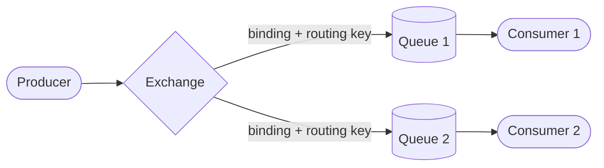

> After a consumer processes a message and sends an **acknowledgement (ack)**, RabbitMQ permanently deletes it from the queue.

---

## Exchange Types

The exchange is the brain of RabbitMQ routing. There are four types:

### 1. Direct Exchange
Routes a message to queues whose binding key **exactly matches** the routing key.

**Example:** An order service publishes with routing key `order.paid`. Only the queue bound to `order.paid` receives it.

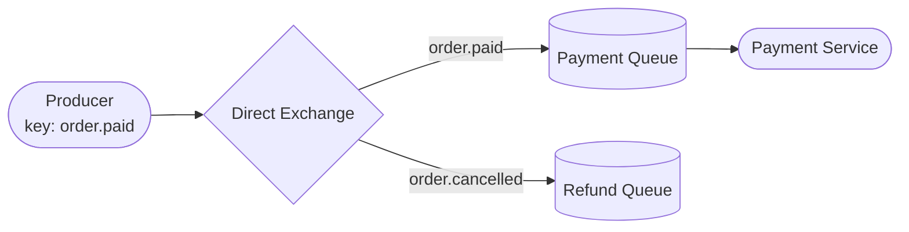

---

### 2. Fanout Exchange
Ignores the routing key entirely and **broadcasts** to every queue bound to it.

**Example:** A user signs up. You want to send a welcome email, create a user profile, and log an analytics event — all at once.

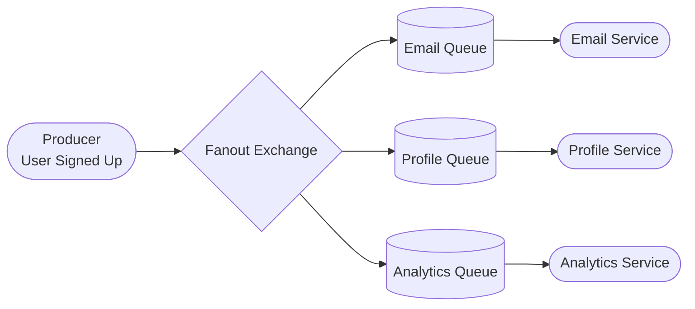

---

### 3. Topic Exchange
Routes based on **pattern matching** on the routing key using wildcards:
- `*` matches exactly one word
- `#` matches zero or more words

**Example:** Routing key `logs.error.payment` would match bindings like `logs.#` or `logs.*.payment`.

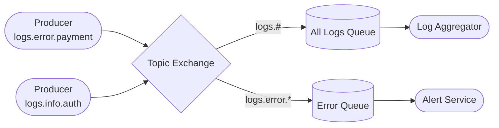

---

### 4. Headers Exchange
Routes based on **message header attributes** instead of the routing key. Useful when routing logic is complex and can't fit a simple key pattern.

**Example:** Route messages with header `format=pdf` to one queue and `format=csv` to another.

---

## Message Acknowledgement

When a consumer receives a message, RabbitMQ waits for an **ack** before deleting it. This guarantees delivery — if the consumer crashes before acking, RabbitMQ requeues the message.

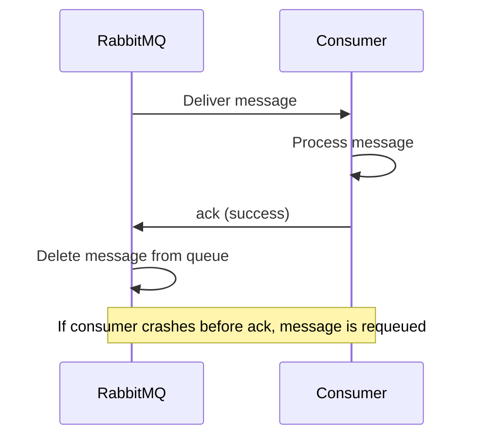

---

## RabbitMQ RPC Pattern

Sometimes a service needs to **send a request and wait for a response** — but you still want to use RabbitMQ instead of a direct HTTP call.

This is the **RPC (Remote Procedure Call)** pattern:
1. Client publishes a request to a queue with a `reply_to` (a temporary callback queue) and a `correlation_id`.
2. Server consumes the request, processes it, and publishes the response to the `reply_to` queue.
3. Client listens on its callback queue and matches the response using the `correlation_id`.

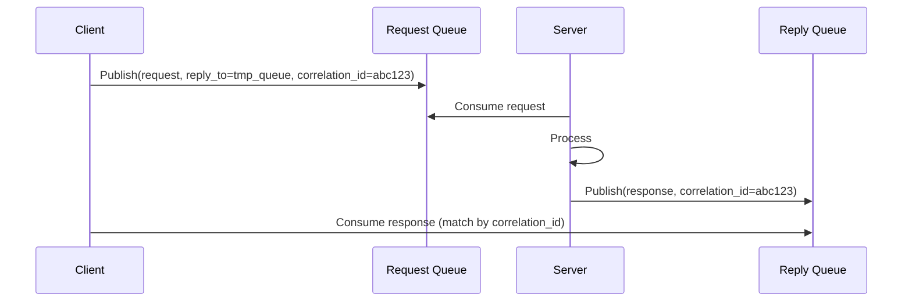

**When to use RPC:** When you need a synchronous-style result but want the reliability and decoupling of a message broker — e.g. a pricing service that must return a calculated price before the checkout can proceed.

---

## Real-World Applications

### 1. Asynchronous Microservice Communication
**Scenario:** Customer places an order.

Instead of the Order Service calling the Payment Service directly (tight coupling, blocking), it publishes an `OrderPlaced` event. The Payment Service consumes it when ready.

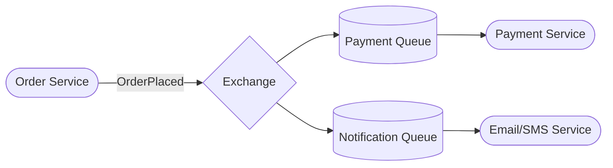

**Benefit:** Order Service doesn't care if Payment Service is slow or temporarily down — messages queue up and get processed when it recovers.

---

### 2. Background Job Processing
**Scenario:** User requests a PDF export of a large report.

Generating the PDF might take 10–30 seconds. Doing this synchronously would time out the HTTP request. Instead:

1. API returns `202 Accepted` immediately.
2. Publishes a `GeneratePdf` job to a queue.
3. A background worker picks it up, generates the PDF, and notifies the user when done.

**Other examples:** sending bulk emails, resizing uploaded images, running nightly data exports.

---

### 3. Rate Limiting / Traffic Shaping
**Scenario:** A third-party SMS API allows only 100 messages/minute.

Publish all SMS tasks to a queue. Configure a single consumer to process them at a controlled rate — RabbitMQ buffers the excess without dropping messages.

---

### 4. Event-Driven Fan-Out
**Scenario:** A new product is added to an e-commerce platform.

One `ProductCreated` event fans out to: search indexing, inventory setup, CDN cache invalidation, and an analytics pipeline — all independent services reacting to the same event with no direct dependencies on each other.

---

## Durability & Message Persistence

By default, queues and messages are **lost if RabbitMQ restarts**. To survive a crash or reboot, you need two things:

| Setting | What it does |
|---------|--------------|
| **Durable queue** | The queue definition survives a broker restart |
| **Persistent message** | The message body is written to disk, not just held in memory |

Both must be set — a persistent message in a non-durable queue is still lost on restart, and vice versa.

**Example gotcha:** You set up a durable queue in dev and everything works. You deploy to prod without marking messages as persistent. RabbitMQ restarts during an upgrade and all in-flight messages vanish.

> In Spring AMQP, queues are declared durable by default and messages can be made persistent by setting `MessageDeliveryMode.PERSISTENT`.

---

## Dead Letter Exchanges (DLX)

What happens when a message **can't be processed**? By default, it's dropped silently. A **Dead Letter Exchange** gives you a safety net — failed messages are rerouted to a separate exchange/queue instead of disappearing.

A message gets dead-lettered when:
- A consumer **rejects** it with `requeue=false`
- The message **TTL (Time-To-Live)** expires
- The queue reaches its **max length** and the message is dropped

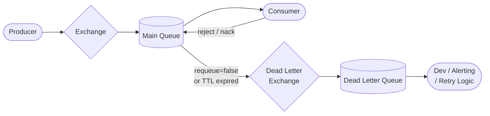

**Why this matters:** Without a DLX, a poison message (one that always causes your consumer to crash) can loop forever or silently vanish. With a DLX, it lands in a separate queue where you can inspect it, alert on it, or retry it after a delay.

**Common use case:** Implement a retry mechanism — dead-lettered messages go to a "wait" queue with a TTL, then get re-published to the original queue after a delay.

---

## Prefetch Count (QoS) & Competing Consumers

### Competing Consumers
You can run **multiple consumers on the same queue** to scale throughput. RabbitMQ distributes messages across them.

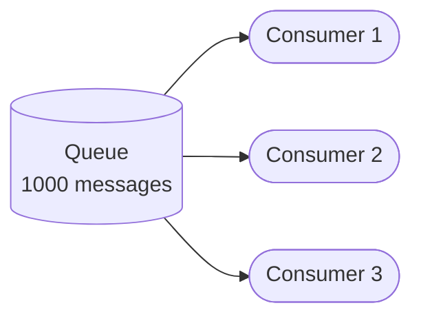

### The Problem with Default Round-Robin
By default, RabbitMQ pre-dispatches messages evenly — Consumer 1 gets messages 1, 4, 7..., Consumer 2 gets 2, 5, 8..., etc. If Consumer 2 is slow, its messages pile up while Consumer 1 sits idle.

### Prefetch Count (QoS) Fix
Setting `prefetch=1` tells RabbitMQ: **don't send a consumer a new message until it has acked the previous one.**

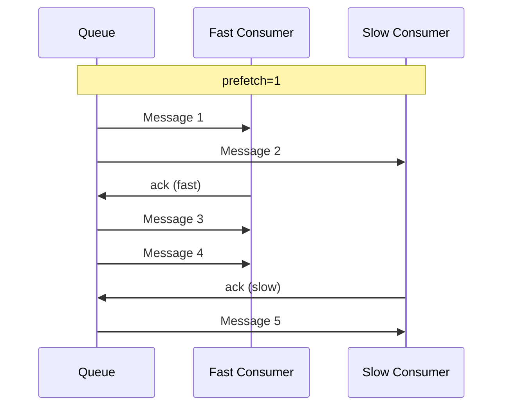

Fast consumers naturally pick up more work. This is the key to fair dispatch and efficient horizontal scaling.

> In Spring AMQP: `factory.setDefaultRequeueRejected(false)` and `SimpleRabbitListenerContainerFactory.setPrefetchCount(1)`.

---

## Publisher Confirms

Acks protect the **consumer side** — but what about the **producer side**? How does a producer know RabbitMQ actually received and stored the message?

**Publisher Confirms** (also called Publisher Acknowledgements) solve this. RabbitMQ sends a confirm back to the producer once the message is safely written to the queue (and to disk, if persistent).

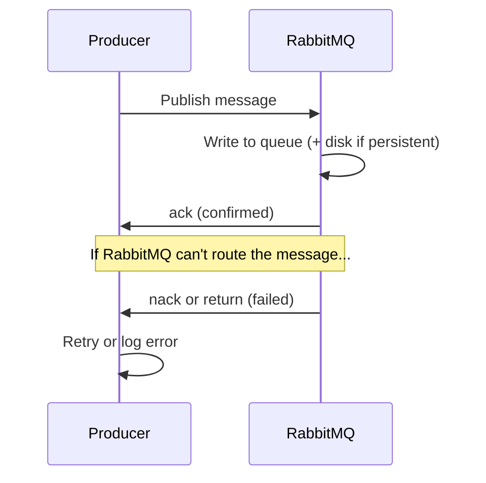

Without publisher confirms, a producer fires and forgets — if RabbitMQ is overloaded or the connection drops mid-publish, the message is silently lost.

**Three confirm modes:**

| Mode | Behavior |
|----------|------------------------------------------------|
| **Simple** | Confirm after each publish (slow, safest) |
| **Batch** | Confirm a batch of messages at once |
| **Async** | RabbitMQ calls back asynchronously (fastest, most complex) |

> In Spring AMQP, enable with `spring.rabbitmq.publisher-confirm-type=correlated` and set a confirm callback on the `RabbitTemplate`.

---

## Summary

```
Producer → Exchange → (routing rules) → Queue(s) → Consumer → ack → message deleted
```

RabbitMQ shines when you need:
- **Decoupling** — services don't call each other directly
- **Resilience** — messages survive consumer downtime
- **Scalability** — add more consumers to a queue to handle load
- **Flexibility** — route the same message to multiple services with different rules
