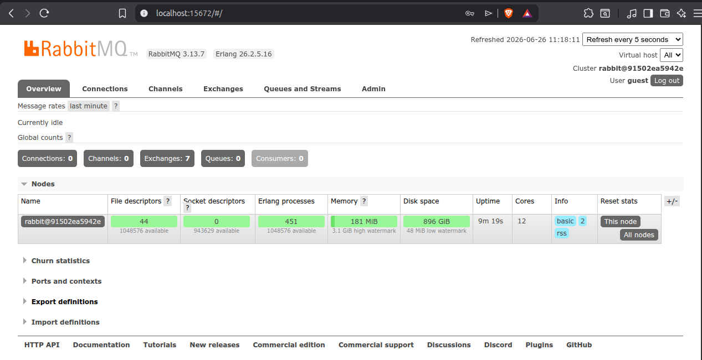
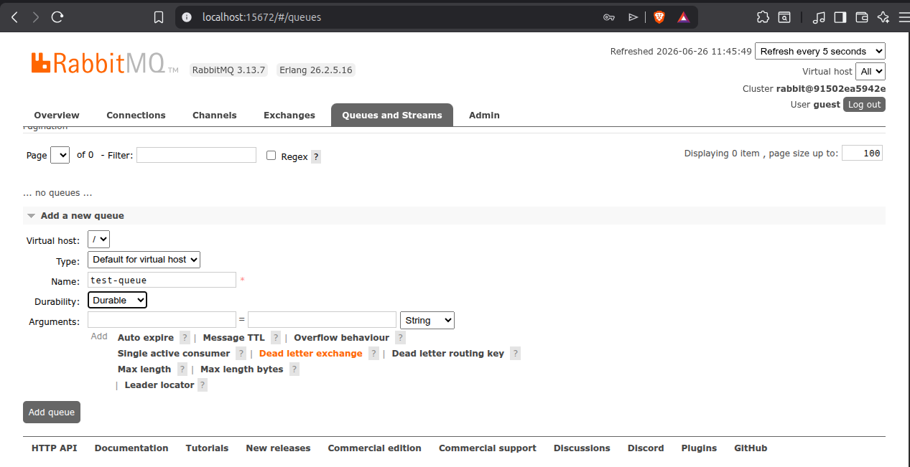

# Lesson 01 — Installing RabbitMQ & Exploring Before Writing Code

> **Goal:** Get RabbitMQ running locally, explore it visually, and understand what you're looking at — before touching any Java.

---

## Why Do This First?

Most people jump straight into code. The problem is that when something goes wrong, they have no mental model of what's happening inside RabbitMQ. Spending 20 minutes in the management UI first means you'll be able to *see* your code working (or failing) later, not just guess.

---

## Step 1 — Run RabbitMQ with Docker

We use Docker because it's the fastest way to get a clean, repeatable RabbitMQ instance with zero system pollution. No install wizards, no PATH issues.

```bash
docker run -d --name rabbitmq \
  -p 5672:5672 \
  -p 15672:15672 \
  rabbitmq:3-management
```

| Port | What it's for |
|------|--------------|
| `5672` | The AMQP port — your Spring Boot app connects here |
| `15672` | The management UI — your browser connects here |

Verify it's running:

```bash
docker ps
```

You should see the `rabbitmq` container with status `Up`.

---

## Step 2 — Open the Management UI

Go to `http://localhost:15672` in your browser.

- **Username:** `guest`
- **Password:** `guest`

You'll land on the Overview page. Take a moment to look at the tabs:


| Tab | What you'll use it for |
|-----|----------------------|
| **Overview** | Health at a glance — message rates, node status |
| **Connections** | See which apps are connected (your Spring app will appear here) |
| **Exchanges** | All exchanges — including the built-in defaults |
| **Queues** | Your queues, message counts, consumer counts |
| **Admin** | Users, virtual hosts, permissions |
---

## Step 3 — Explore the Default Exchanges

Click the **Exchanges** tab. You'll see several exchanges already there — RabbitMQ creates these by default:

| Exchange | Type | Purpose |
|----------|------|---------|
| `(AMQP default)` | Direct | Routes by queue name — used when you publish without specifying an exchange |
| `amq.direct` | Direct | Built-in direct exchange |
| `amq.fanout` | Fanout | Built-in fanout exchange |
| `amq.topic` | Topic | Built-in topic exchange |
| `amq.headers` | Headers | Built-in headers exchange |

You haven't created any queues yet, so the **Queues** tab will be empty. That's expected.

---

## Step 4 — Manually Create a Queue

Click **Queues** → **Add a new queue**.

Fill in:
- **Name:** `test-queue`
- **Durability:** `Durable`
- Leave everything else as default

Click **Add queue**. You now have your first queue.

---

## Step 5 — Manually Publish a Message

Click **Exchanges** → click on the exchange with an empty name at the top of the list — it shows as `(AMQP default)`.

> **Not** `amq.direct`. That one requires an explicit binding to the queue first. The AMQP default exchange is special — it automatically routes any message to the queue whose name matches the routing key, with no binding needed.

Scroll down to **Publish message**:
- **Routing key:** `test-queue`
- **Payload:** `Hello from the UI!`

Click **Publish message**.

Now click back to **Queues** → `test-queue`. You'll see **Ready: 1** — there's one message waiting.

---

## Step 6 — Manually Consume the Message

On the `test-queue` page, scroll down to **Get messages**:
- **Ack mode:** `Ack message requeue false` (this acks and removes it)
- Click **Get Message(s)**

You'll see your message body: `Hello from the UI!`

Check the queue again — **Ready: 0**. The message is gone because you acked it.

**Try this:** Publish a message again but this time use `Nack message requeue true` when consuming. Watch the message count stay at 1 — it was put back in the queue.

### What Does Requeue Actually Mean?

When a consumer receives a message and something goes wrong, **requeue** controls where the message goes next:

- **requeue = true** — RabbitMQ puts the message back at the front of the queue, ready to be delivered again
- **requeue = false** — RabbitMQ drops it permanently (or sends it to a Dead Letter Exchange if one is configured)

**The danger with requeue = true:** if the message itself is the problem — bad data, a bug in your consumer — it will come back instantly, fail again, come back again, and loop forever. This is called a **poison message**. It can peg your consumer at 100% CPU processing the same broken message in a tight loop.

**That's exactly why DLX exists** — instead of `requeue = true` (loop forever) or `requeue = false` (lose it silently), you set `requeue = false` and let the DLX catch it. The message is preserved somewhere you can inspect it, without blocking your queue.

```
Message fails processing
        │
        ├── Transient error (network blip, timeout)?
        │         └── requeue = true  → retry makes sense
        │
        └── Bad message or a bug in the consumer?
                  └── requeue = false → DLX catches it → inspect / alert / retry later
```

---

## Step 7 — Things to Explore on Your Own

Before moving to code, spend a few minutes poking around:

- Publish 5 messages to `test-queue`. Watch the **Ready** count go up.
- Click on a queue — find the **Bindings** section. Notice `test-queue` has no explicit binding yet the message arrived via the AMQP default exchange. Every queue is automatically bound to the default exchange using its own name as the routing key — you can't see or remove this binding, it's built into RabbitMQ.
- Go to **Overview** and look at the **Message rates** graph after publishing a few messages.
- Click **Connections** — it's empty because no app is connected yet. Come back here once you run your Spring Boot app in the next lesson.

---

## Checkpoint

Before moving on, you should be able to answer these:

- [ ] Where does your Spring app connect? (which port?)
- [ ] What's the difference between the **Ready** and **Unacked** counts in a queue?
- [ ] What happened to the message when you acked it vs nacked + requeued it?
- [ ] Why does publishing to the AMQP default exchange with routing key `test-queue` land in `test-queue`? Why wouldn't the same work with `amq.direct`?

---

## Next

`02-hello-world.md` — Write your first producer and consumer in Spring Boot and watch the messages flow through the UI you just explored.
