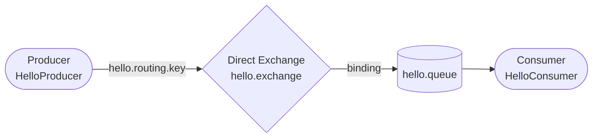

# Lesson 02 — Hello World in RabbitMQ with Spring Boot

> **Goal:** Write the simplest possible producer and consumer. One sends a message, one receives it. Watch it happen live in the management UI.

---

## What We're Building



One exchange, one queue, one producer, one consumer. Nothing else.

---

## Project Setup

Your `pom.xml` already has everything you need:

```xml
<dependency>
    <groupId>org.springframework.boot</groupId>
    <artifactId>spring-boot-starter-amqp</artifactId>
</dependency>
```

`spring-boot-starter-amqp` gives you:
- `RabbitTemplate` — for sending messages
- `@RabbitListener` — for receiving messages
- Auto-configuration for connecting to RabbitMQ

---

## Step 1 — Configure the Connection

Add the RabbitMQ connection to `src/main/resources/application.yml`:

```yaml
spring:
  application:
    name: spring-boot-rabbitmq
  rabbitmq:
    host: localhost
    port: 5672
    username: guest
    password: guest
```

Spring Boot will auto-connect using these values on startup.

---

## Step 2 — Declare the Exchange, Queue, and Binding

Create `src/main/java/com/javaguy/springrabbitmq/config/RabbitMQConfig.java`:

```java
@Configuration
public class RabbitMQConfig {

    public static final String QUEUE    = "hello.queue";
    public static final String EXCHANGE = "hello.exchange";
    public static final String ROUTING_KEY = "hello.routing.key";

    @Bean
    public Queue queue() {
        return new Queue(QUEUE, true); // true = durable
    }

    @Bean
    public DirectExchange exchange() {
        return new DirectExchange(EXCHANGE);
    }

    @Bean
    public Binding binding(Queue queue, DirectExchange exchange) {
        return BindingBuilder
                .bind(queue)
                .to(exchange)
                .with(ROUTING_KEY);
    }
}
```

**What's happening here:**
- `Queue(QUEUE, true)` — declares a durable queue (survives restart)
- `DirectExchange` — routes messages by exact routing key match
- `BindingBuilder` — links the queue to the exchange via the routing key
- Spring will create these in RabbitMQ on startup if they don't already exist

---

## Step 3 — Write the Producer

Create `src/main/java/com/javaguy/springrabbitmq/producer/HelloProducer.java`:

```java
@Component
public class HelloProducer {

    private final RabbitTemplate rabbitTemplate;

    public HelloProducer(RabbitTemplate rabbitTemplate) {
        this.rabbitTemplate = rabbitTemplate;
    }

    public void send(String message) {
        System.out.println("Sending: " + message);
        rabbitTemplate.convertAndSend(
            RabbitMQConfig.EXCHANGE,
            RabbitMQConfig.ROUTING_KEY,
            message
        );
    }
}
```

`RabbitTemplate.convertAndSend(exchange, routingKey, message)` — this is the core method you'll use constantly. It:
1. Converts the Java object to a message (String → bytes here)
2. Publishes it to the specified exchange with the specified routing key

---

## Step 4 — Write the Consumer

Create `src/main/java/com/javaguy/springrabbitmq/consumer/HelloConsumer.java`:

```java
@Component
public class HelloConsumer {

    @RabbitListener(queues = RabbitMQConfig.QUEUE)
    public void receive(String message) {
        System.out.println("Received: " + message);
    }
}
```

`@RabbitListener(queues = ...)` — Spring registers this method as a listener on the queue. When a message arrives, Spring calls this method and passes the message body. The ack is sent automatically after the method returns without throwing.

---

## Step 5 — Trigger the Producer

The easiest way to test without a frontend is a REST endpoint. Create `src/main/java/com/javaguy/springrabbitmq/controller/HelloController.java`:

```java
@RestController
@RequestMapping("/api")
public class HelloController {

    private final HelloProducer producer;

    public HelloController(HelloProducer producer) {
        this.producer = producer;
    }

    @PostMapping("/send")
    public ResponseEntity<String> send(@RequestParam String message) {
        producer.send(message);
        return ResponseEntity.ok("Message sent: " + message);
    }
}
```

---

## Step 6 — Run and Observe

Start the application. You should see Spring connect to RabbitMQ in the logs.

Now open the management UI (`http://localhost:15672`) and:
1. Go to **Exchanges** — you'll see `hello.exchange` has appeared
2. Go to **Queues** — you'll see `hello.queue` with 1 consumer connected
3. Go to **Connections** — your Spring app is now listed

Send a message:

```bash
curl -X POST "http://localhost:8081/api/send?message=Hello+RabbitMQ"
```

Watch the console:
```
Sending: Hello RabbitMQ
Received: Hello RabbitMQ
```

The message was sent and consumed so fast it may never appear in the queue UI — the consumer is always ready. That's a good sign.

---

## Step 7 — Slow it Down to See What's Happening

When your consumer is running normally, messages are consumed the instant they arrive — too fast to see in the UI. Here are two ways to slow things down so you can actually watch messages sit in the queue.

---

### Option A — Add a delay inside the consumer

**1.** Temporarily change `HelloConsumer.java` to sleep for 5 seconds before processing:

```java
@RabbitListener(queues = RabbitMQConfig.QUEUE)
public void receive(String message) throws InterruptedException {
    Thread.sleep(5000); // wait 5 seconds before processing
    System.out.println("Received: " + message);
}
```

**2.** Restart the app.

**3.** Run this in your terminal to send 5 messages quickly, one after another:

```bash
for i in 1 2 3 4 5; do
  curl -s -X POST "http://localhost:8081/api/send?message=Message$i"
done
```

**4.** Immediately open `http://localhost:15672` → **Queues** → `hello.queue`.

You'll see **Ready** counting up as messages arrive faster than the consumer can handle them. Then watch it drain slowly — one message every 5 seconds — as the consumer works through them.

**5.** Remove the `Thread.sleep` when you're done.

---

### Option B — Remove the consumer entirely, then bring it back

This shows you that RabbitMQ holds messages safely even when no consumer exists.

**1.** Comment out the `@RabbitListener` annotation in `HelloConsumer.java`:

```java
// @RabbitListener(queues = RabbitMQConfig.QUEUE)
public void receive(String message) {
    System.out.println("Received: " + message);
}
```

**2.** Restart the app. Go to `http://localhost:15672` → **Queues** → `hello.queue`. Notice **Consumers: 0** — nobody is listening.

**3.** Send 5 messages:

```bash
for i in 1 2 3 4 5; do
  curl -s -X POST "http://localhost:8081/api/send?message=Message$i"
done
```

**4.** Check the queue — **Ready: 5**. Messages are sitting there, waiting. RabbitMQ is holding them safely.

**5.** Now uncomment `@RabbitListener` and restart. Watch all 5 messages get consumed immediately on startup — they were waiting the whole time.

**The lesson:** RabbitMQ doesn't need the producer and consumer to be alive at the same time. The queue bridges the gap.

---

## What You Should Understand by Now

- Why constants for queue/exchange/routing key names? — typos at runtime are silent failures. Constants catch them at compile time.
- Why `true` (durable) on the queue? — without it, the queue disappears on RabbitMQ restart and you lose all messages in it.
- What sends the ack? — Spring sends it automatically after `receive()` returns. If `receive()` throws, Spring nacks and requeues by default.
- What is `convertAndSend` actually converting? — String → `byte[]` using a `MessageConverter`. When you later send objects (not strings), you'll configure a `Jackson2JsonMessageConverter` here.

---

## Exercises Before Moving On

Try each one yourself first, then expand the answer.

---

**1. Send 10 messages in a loop from the controller. Observe the queue briefly fill up.**

```bash
for i in $(seq 1 10); do
  curl -s -X POST "http://localhost:8081/api/send?message=Message$i"
done
```

Open `http://localhost:15672` → **Queues** → `hello.queue` while this runs. What do you see?

<details>
<summary>Reveal answer</summary>

You'll likely see the **Ready** count flicker briefly before hitting 0. The consumer is so fast it processes messages almost as fast as they arrive. To actually see them pile up, add `Thread.sleep(200)` inside `receive()` and try again — the queue will visibly fill up before draining.

This demonstrates that a single consumer can handle steady load, but if messages arrive faster than they can be processed, you need more consumers. That's the next lesson.

</details>

---

**2. Throw a `RuntimeException` inside `receive()`. Watch what happens — does the message come back? Does it loop?**

```java
@RabbitListener(queues = RabbitMQConfig.QUEUE)
public void receive(String message) {
    throw new RuntimeException("Something went wrong!");
}
```

Send one message. Watch the console.

<details>
<summary>Reveal answer</summary>

Yes — it loops. The message comes back instantly and the exception fires again, over and over. You'll see the stack trace repeating endlessly in the console.

This is the **poison message** problem. Spring's default behaviour on an exception is `nack + requeue = true`, so RabbitMQ puts the message straight back and the consumer picks it up again immediately.

In the management UI, check the **Unacked** count on `hello.queue` — it will flicker between 0 and 1 as the message bounces. This is exactly the scenario a Dead Letter Exchange is designed to prevent. You'll configure one in a later lesson.

For now, stop the loop by stopping the app or by catching the exception instead of letting it propagate.

</details>

---

**3. Comment out `@RabbitListener`, restart, and send 5 messages. Now uncomment it and restart — do the queued messages get consumed?**

<details>
<summary>Reveal answer</summary>

Yes — all 5 messages are consumed immediately when the app restarts with `@RabbitListener` active.

This proves that RabbitMQ holds messages durably regardless of whether a consumer exists. The queue was declared with `durable = true`, so messages survived even a broker restart (if one had happened). This is the fundamental reliability guarantee of a message queue: producers and consumers don't need to be alive at the same time.

</details>

---

**4. Go to the Exchanges tab and click on `hello.exchange` — can you see the binding to `hello.queue` listed there?**

<details>
<summary>Reveal answer</summary>

Yes. Click **Exchanges** → `hello.exchange` → scroll down to **Bindings**. You'll see:

```
To          Routing key
hello.queue hello.routing.key
```

This binding was created by the `BindingBuilder` in `RabbitMQConfig` when the app started. It's what tells `hello.exchange` to forward any message with routing key `hello.routing.key` to `hello.queue`.

Try changing the routing key in `HelloProducer` to something else (e.g. `wrong.key`) and sending a message. It will silently disappear — the exchange has no binding for that key, so the message is dropped.

</details>

---

## Checkpoint

- [ ] Can you explain what each of the three beans in `RabbitMQConfig` does?
- [ ] What would happen if you changed the routing key in the producer but not the binding?
- [ ] What does `@RabbitListener` do automatically that you'd otherwise have to do manually?

---

## Next

`03-work-queues.md` — Run multiple consumers on the same queue and learn how RabbitMQ distributes work between them. This is where prefetch count becomes important.
