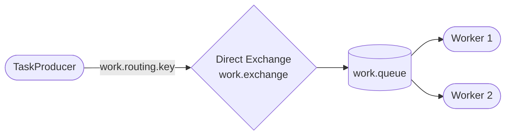
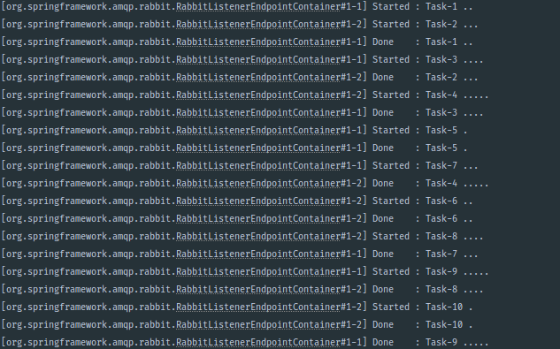

# Lesson 03 — Work Queues

> **Goal:** Distribute slow tasks across multiple workers. Understand the difference between round-robin dispatch and fair dispatch, and see why manual acknowledgement matters when work can fail mid-way.

---

## What We're Building



Same queue, two workers competing to pull tasks off it. RabbitMQ decides which worker gets each message.

---

## The Problem This Solves

In the Hello World lesson, a single consumer handled every message. That works fine for fast, lightweight messages. But what about slow tasks — generating a PDF, resizing a batch of images, sending 500 emails?

If one consumer blocks for 10 seconds per task, your queue backs up. The solution is to **run multiple workers on the same queue**. RabbitMQ distributes the tasks between them automatically.

This pattern is called a **work queue** (also: task queue, competing consumers).

---

## Step 1 — Add the Work Queue Configuration

Add a second queue, exchange, and binding to `RabbitMQConfig.java`. Keep all the existing Hello World constants — just add below them.

```java
public static final String WORK_QUEUE       = "work.queue";
public static final String WORK_EXCHANGE    = "work.exchange";
public static final String WORK_ROUTING_KEY = "work.routing.key";

@Bean
public Queue workQueue() {
    return new Queue(WORK_QUEUE, true);
}

@Bean
public DirectExchange workExchange() {
    return new DirectExchange(WORK_EXCHANGE);
}

@Bean
public Binding workBinding() {
    return BindingBuilder
            .bind(workQueue())
            .to(workExchange())
            .with(WORK_ROUTING_KEY);
}
```

> **Why call `workQueue()` and `workExchange()` directly instead of injecting them as parameters?**
> The existing `binding(Queue queue, DirectExchange exchange)` method uses parameter injection — Spring finds the beans by type. Once you add a second `Queue` and a second `DirectExchange`, Spring sees two candidates and doesn't know which one to inject. Calling the `@Bean` methods directly sidesteps the ambiguity entirely.

---

## Step 2 — Configure a Container Factory for Workers

A **container factory** is how you configure a group of listeners — things like how many messages to pre-fetch, whether acks are automatic or manual, and how many concurrent threads to use.

The default factory (used by `HelloConsumer`) uses auto-ack and pre-fetches many messages at once. For work queues you want manual control. Add this bean to `RabbitMQConfig.java`:

```java
@Bean
public SimpleRabbitListenerContainerFactory workerContainerFactory(
        ConnectionFactory connectionFactory) {
    SimpleRabbitListenerContainerFactory factory = new SimpleRabbitListenerContainerFactory();
    factory.setConnectionFactory(connectionFactory);
    factory.setAcknowledgeMode(AcknowledgeMode.MANUAL);
    factory.setPrefetchCount(1);
    return factory;
}
```

**What each setting does:**

| Setting | Value | Effect |
|---------|-------|--------|
| `AcknowledgeMode.MANUAL` | `MANUAL` | Your code calls `channel.basicAck()` — the ack is not sent automatically |
| `setPrefetchCount(1)` | `1` | RabbitMQ won't send a worker a new message until it has acked the previous one |

> **Imports you'll need:**
> ```java
> import org.springframework.amqp.core.AcknowledgeMode;
> import org.springframework.amqp.rabbit.config.SimpleRabbitListenerContainerFactory;
> import org.springframework.amqp.rabbit.connection.ConnectionFactory;
> ```

---

## Step 3 — Write the Task Producer

Create `src/main/java/com/javaguy/springrabbitmq/producer/TaskProducer.java`:

```java
@Component
public class TaskProducer {

    private final RabbitTemplate rabbitTemplate;

    public TaskProducer(RabbitTemplate rabbitTemplate) {
        this.rabbitTemplate = rabbitTemplate;
    }

    public void dispatch(String task) {
        System.out.println("[Producer] Dispatching: " + task);
        rabbitTemplate.convertAndSend(WORK_EXCHANGE, WORK_ROUTING_KEY, task);
    }
}
```

Nothing new here — same `convertAndSend` as before, just pointed at the work exchange.

---

## Step 4 — Write the Worker Consumer

Create `src/main/java/com/javaguy/springrabbitmq/consumer/WorkerConsumer.java`:

```java
@Component
public class WorkerConsumer {

    @RabbitListener(
        queues = WORK_QUEUE,
        containerFactory = "workerContainerFactory",
        concurrency = "2"
    )
    public void processTask(
            String task,
            Channel channel,
            @Header(AmqpHeaders.DELIVERY_TAG) long deliveryTag
    ) throws IOException, InterruptedException {

        String worker = Thread.currentThread().getName();
        System.out.println("[" + worker + "] Started : " + task);

        try {
            int dots = (int) task.chars().filter(c -> c == '.').count();
            Thread.sleep(dots * 1000L); // 1 second per dot
            System.out.println("[" + worker + "] Done    : " + task);
            channel.basicAck(deliveryTag, false);
        } catch (Exception e) {
            System.out.println("[" + worker + "] Failed  : " + task);
            channel.basicNack(deliveryTag, false, true); // requeue on unexpected failure
        }
    }
}
```

**What's new here:**

| Code | What it does |
|------|-------------|
| `containerFactory = "workerContainerFactory"` | Uses the factory you defined — manual ack, prefetch 1 |
| `concurrency = "2"` | Spring spins up 2 listener threads, simulating 2 workers |
| `Channel channel` | The raw AMQP channel — needed to manually ack or nack |
| `@Header(AmqpHeaders.DELIVERY_TAG) long deliveryTag` | The unique ID for this delivery, required by `basicAck`/`basicNack` |
| `dots * 1000L` | Each `.` in the task name = 1 second of simulated work |
| `channel.basicAck(deliveryTag, false)` | Tells RabbitMQ: message processed successfully, delete it |
| `channel.basicNack(deliveryTag, false, true)` | Tells RabbitMQ: something unexpected failed, put it back |

> **Imports you'll need:**
> ```java
> import com.rabbitmq.client.Channel;
> import org.springframework.amqp.support.AmqpHeaders;
> import org.springframework.messaging.handler.annotation.Header;
> import java.io.IOException;
> ```

---

## Step 5 — Add a REST Endpoint

Create `src/main/java/com/javaguy/springrabbitmq/controller/TaskController.java`:

```java
@RestController
@RequestMapping("/api/tasks")
public class TaskController {

    private final TaskProducer taskProducer;

    public TaskController(TaskProducer taskProducer) {
        this.taskProducer = taskProducer;
    }

    @PostMapping("/send")
    public ResponseEntity<String> send(@RequestParam String task) {
        taskProducer.dispatch(task);
        return ResponseEntity.ok("Dispatched: " + task);
    }

    @PostMapping("/batch")
    public ResponseEntity<String> batch(@RequestParam(defaultValue = "10") int count) {
        for (int i = 1; i <= count; i++) {
            String dots = ".".repeat((i % 5) + 1); // 1 to 5 seconds of work
            taskProducer.dispatch("Task-" + i + " " + dots);
        }
        return ResponseEntity.ok("Dispatched " + count + " tasks");
    }
}
```

The `/batch` endpoint sends `count` tasks where each task's "weight" varies (1–5 dots). This is what makes the fair dispatch vs round-robin comparison visible.

---

## Step 6 — Run and Observe

Start the app. Open `http://localhost:15672` → **Queues** — you should see `work.queue` appear with **Consumers: 2** (your two worker threads).

### 6a — Observe fair dispatch in action

Dispatch 10 tasks:

```bash
curl -X POST "http://localhost:8081/api/tasks/batch?count=10"
```

Watch the console. You'll see output like:

```
[Worker-1] Started : Task-1 .
[Worker-2] Started : Task-2 ..
[Worker-1] Done    : Task-1 .
[Worker-1] Started : Task-3 ...
[Worker-2] Done    : Task-2 ..
[Worker-2] Started : Task-4 ....
```

Notice that Worker-1 (fast tasks) picks up more work than Worker-2 (slow tasks). That's **fair dispatch** — `prefetch=1` forces RabbitMQ to only send a worker a new message when it's ready for one. Fast workers naturally process more.

### 6b — See what round-robin looks like

To understand why prefetch=1 matters, temporarily change `factory.setPrefetchCount(1)` to `factory.setPrefetchCount(10)` in your config. Restart and send another batch.

Now you'll see each worker gets 5 tasks pre-assigned — even if Worker-2 is slow and Worker-1 finished its 5 tasks long ago, Worker-1 has nothing to do. Worker-2's 5 tasks are locked to it. That's the round-robin problem.

Change it back to `prefetchCount(1)` when done.    


---

## Step 7 — See Manual Ack Save a Message

Manual ack means if your worker dies mid-task, the message is not lost.

**Try this:**

1. Send a single slow task:
   ```bash
   curl -X POST "http://localhost:8081/api/tasks/send?task=SlowTask....."
   ```

2. While the consumer is sleeping (5 seconds), **stop the application**.

3. Go to `http://localhost:15672` → **Queues** → `work.queue`.

4. The message is back in **Ready** — not lost. RabbitMQ knew the ack never arrived, so it requeued the message automatically.

5. Restart the app — the message gets picked up and processed.

**This is the core value of manual ack:** RabbitMQ holds the message as "Unacked" until your code explicitly calls `basicAck`. If the connection drops before that, the message returns to the queue. With auto-ack, RabbitMQ removes the message the moment it's delivered — if the worker crashes while processing, the message is gone.

---

## What You Should Understand by Now

- What `concurrency = "2"` actually does — it's not two JVM instances, it's two listener threads within one consumer bean.
- Why `prefetch=1` is the key to fair dispatch — without it, RabbitMQ pre-assigns messages in round-robin before workers even ask.
- The difference between `basicAck` and `basicNack` — one removes the message, the other can either requeue it or drop it.
- When to use `requeue = true` vs `requeue = false` in a nack — transient failures (timeout, network) → requeue; bad messages or bugs → don't requeue (or you loop forever).

---

## Exercises Before Moving On

---

**1. Set `prefetchCount` to 10, dispatch a batch of 10 tasks, and compare the console output to `prefetchCount=1`. What do you notice about how tasks are distributed?**

<details>
<summary>Reveal answer</summary>

With `prefetchCount=10`, RabbitMQ pre-assigns tasks in round-robin before workers start: Worker-1 gets tasks 1, 3, 5, 7, 9 and Worker-2 gets tasks 2, 4, 6, 8, 10. Worker-1 will finish all 5 of its tasks (short ones) and then sit idle while Worker-2 is still grinding through its remaining tasks (including the long ones).

With `prefetchCount=1`, once Worker-1 finishes Task-1, it immediately receives the next available task from the queue. Fast workers carry more of the load. That's fair dispatch.

</details>

---

**2. In `WorkerConsumer`, change the catch block to use `requeue = false` instead of `true`. Then throw a `RuntimeException` inside the try block. What happens to the message — does it loop?**

```java
channel.basicNack(deliveryTag, false, false); // drop it
```

<details>
<summary>Reveal answer</summary>

With `requeue = false`, the message is discarded (or dead-lettered, if you've configured a DLX). It does not come back. The consumer does not loop.

With `requeue = true` (the original), the message comes back immediately, fails again, and loops forever — exactly the poison message problem from Lesson 02.

For production: use `requeue = false` and configure a Dead Letter Exchange so the failed message lands somewhere you can inspect it, rather than disappearing silently.

</details>

---

**3. Change `concurrency = "2"` to `concurrency = "1"`. Dispatch 5 tasks. How does the throughput change?**

<details>
<summary>Reveal answer</summary>

With one worker, tasks are processed strictly one at a time. Task 2 can't start until Task 1 is done and acked. Total time = sum of all individual task durations.

With two workers, two tasks run in parallel. Total time ≈ half (depending on how evenly tasks are distributed). This demonstrates that the queue itself is the bottleneck limiter — adding consumers to a queue scales throughput horizontally without changing the producer or the queue configuration at all.

</details>

---

**4. What happens if you remove the `try/catch` entirely and let the `InterruptedException` propagate? Does Spring nack automatically?**

<details>
<summary>Reveal answer</summary>

With `AcknowledgeMode.MANUAL`, throwing an uncaught exception does NOT automatically nack. The message stays in the **Unacked** state indefinitely (until the connection closes, at which point RabbitMQ requeues it).

With `AcknowledgeMode.AUTO` (the default), Spring nacks and requeues on any exception. But in manual mode, **you are responsible for calling basicAck or basicNack in every code path** — otherwise messages silently pile up as Unacked.

</details>

---

## Checkpoint

- [ ] What is `concurrency = "2"` actually creating — threads or JVM instances?
- [ ] What does `prefetchCount(1)` tell RabbitMQ to do differently?
- [ ] With `MANUAL` ack mode, what happens to a message if your worker crashes before calling `basicAck`?
- [ ] When would you use `requeue = true` vs `requeue = false` in a nack?

---

## Next

`04-fanout.md` — Send one message to multiple queues simultaneously using a Fanout Exchange. This is the foundation of event-driven fan-out patterns.
