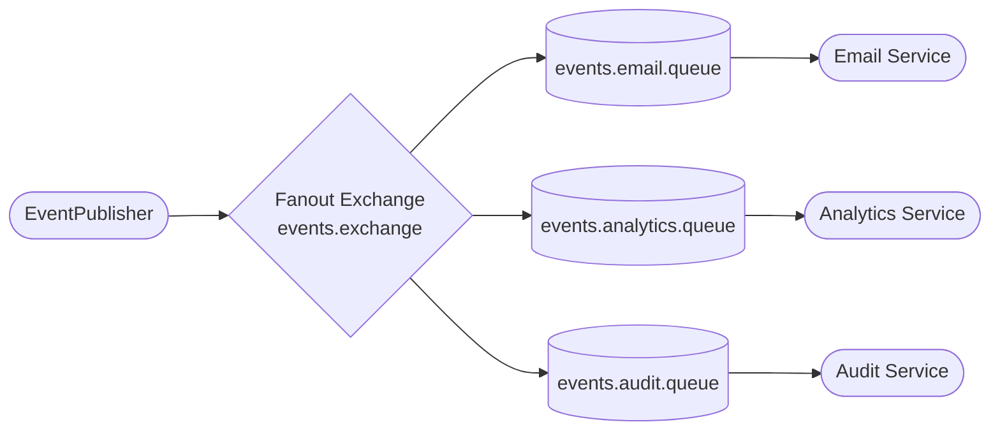
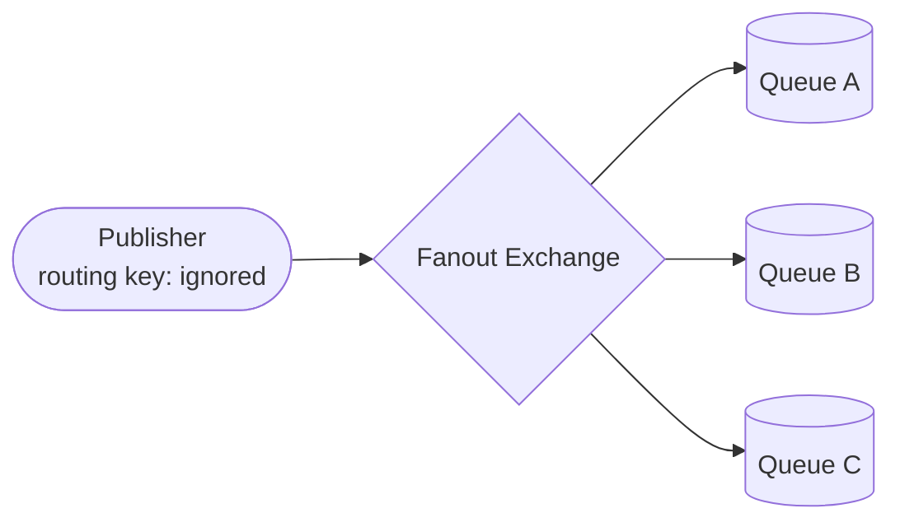

# Lesson 04 — Pub/Sub with a Fanout Exchange

> **Goal:** Publish one event and have every subscriber receive a copy of it simultaneously. Understand why this requires a fanout exchange and why each subscriber needs its own queue.

---

## What We're Building



One publisher. One exchange. Three queues. Every subscriber gets a copy of every message.

**Scenario:** A user signs up. Three independent services all need to react — send a welcome email, log an analytics event, write an audit record. None of them should block each other, and the publisher shouldn't need to know they exist.

---

## How This Differs from Work Queues

This is the most important thing to understand before writing any code:

| Work Queue (Lesson 03) | Pub/Sub (This Lesson) |
|------------------------|----------------------|
| Multiple consumers on **one queue** | Multiple consumers each on **their own queue** |
| One message → processed by **one** worker | One message → processed by **all** subscribers |
| Goal: share the load | Goal: broadcast to everyone |

The queue is the key. If two consumers share a queue, RabbitMQ delivers each message to only one of them — that's work queue behavior. For pub/sub, every subscriber needs its own queue so every subscriber gets its own copy.

---

## What is a Fanout Exchange?

A fanout exchange **ignores the routing key entirely** and delivers every message to every queue bound to it. When a new subscriber joins, they just bind a new queue to the exchange — the publisher doesn't change at all.



---

## Step 1 — Add the Fanout Configuration

Add these constants and beans to `RabbitMQConfig.java` below the existing work queue entries:

```java
public static final String FANOUT_EXCHANGE    = "events.exchange";
public static final String EMAIL_QUEUE        = "events.email.queue";
public static final String ANALYTICS_QUEUE    = "events.analytics.queue";
public static final String AUDIT_QUEUE        = "events.audit.queue";

@Bean
public FanoutExchange fanoutExchange() {
    return new FanoutExchange(FANOUT_EXCHANGE);
}

@Bean
public Queue emailQueue() {
    return new Queue(EMAIL_QUEUE, true);
}

@Bean
public Queue analyticsQueue() {
    return new Queue(ANALYTICS_QUEUE, true);
}

@Bean
public Queue auditQueue() {
    return new Queue(AUDIT_QUEUE, true);
}

@Bean
public Binding emailBinding() {
    return BindingBuilder.bind(emailQueue()).to(fanoutExchange());
}

@Bean
public Binding analyticsBinding() {
    return BindingBuilder.bind(analyticsQueue()).to(fanoutExchange());
}

@Bean
public Binding auditBinding() {
    return BindingBuilder.bind(auditQueue()).to(fanoutExchange());
}
```

**Notice what's missing:** there is no `.with(routingKey)` on any of the bindings. Fanout exchanges don't use routing keys — you bind a queue to the exchange and that's it. RabbitMQ sends everything to everyone.

> **Import you'll need:**
> ```java
> import org.springframework.amqp.core.FanoutExchange;
> ```

---

## Step 2 — Write the Publisher

Create `src/main/java/com/javaguy/springrabbitmq/producer/EventPublisher.java`:

```java
@Component
public class EventPublisher {

    private final RabbitTemplate rabbitTemplate;

    public EventPublisher(RabbitTemplate rabbitTemplate) {
        this.rabbitTemplate = rabbitTemplate;
    }

    public void publish(String event) {
        System.out.println("[Publisher] Broadcasting: " + event);
        rabbitTemplate.convertAndSend(FANOUT_EXCHANGE, "", event);
    }
}
```

The routing key is `""` — an empty string. The fanout exchange ignores it, but `convertAndSend` still requires a value. Convention is to pass an empty string so it's clear you know it's ignored.

---

## Step 3 — Write the Subscribers

Create `src/main/java/com/javaguy/springrabbitmq/consumer/EventSubscribers.java`:

```java
@Component
public class EventSubscribers {

    @RabbitListener(queues = EMAIL_QUEUE)
    public void onEmail(String event) {
        System.out.println("[Email Service    ] Sending welcome email for: " + event);
    }

    @RabbitListener(queues = ANALYTICS_QUEUE)
    public void onAnalytics(String event) {
        System.out.println("[Analytics Service] Logging signup event: " + event);
    }

    @RabbitListener(queues = AUDIT_QUEUE)
    public void onAudit(String event) {
        System.out.println("[Audit Service    ] Recording event: " + event);
    }
}
```

Three separate listeners, each on its own queue. All three run in parallel — none of them waits for the others.

---

## Step 4 — Add a REST Endpoint

Add a new controller or extend `HelloController` with an events endpoint. Create `src/main/java/com/javaguy/springrabbitmq/controller/EventController.java`:

```java
@RestController
@RequestMapping("/api/events")
public class EventController {

    private final EventPublisher eventPublisher;

    public EventController(EventPublisher eventPublisher) {
        this.eventPublisher = eventPublisher;
    }

    @PostMapping("/publish")
    public ResponseEntity<String> publish(@RequestParam String event) {
        eventPublisher.publish(event);
        return ResponseEntity.ok("Broadcasted: " + event);
    }
}
```

---

## Step 5 — Run and Observe

Start the app. Go to `http://localhost:15672` → **Exchanges** — you'll see `events.exchange` with type `fanout`.

Click on it and scroll to **Bindings**. You'll see all three queues bound to it — no routing keys listed.

Now publish an event:

```bash
curl -X POST "http://localhost:8081/api/events/publish?event=user.signup:dan@example.com"
```

Watch the console. You should see all three subscribers fire almost simultaneously:

```
[Publisher]         Broadcasting: user.signup:dan@example.com
[Email Service    ] Sending welcome email for: user.signup:dan@example.com
[Analytics Service] Logging signup event: user.signup:dan@example.com
[Audit Service    ] Recording event: user.signup:dan@example.com
```

Publish it again. All three fire again. Every event, every subscriber, every time.

---

## Step 6 — See What Happens When a Subscriber is Slow

Add a `Thread.sleep(5000)` to `onEmail`:

```java
@RabbitListener(queues = EMAIL_QUEUE)
public void onEmail(String event) throws InterruptedException {
    Thread.sleep(5000);
    System.out.println("[Email Service    ] Sending welcome email for: " + event);
}
```

Restart and publish an event. Notice that `Analytics` and `Audit` complete instantly — the slow email service doesn't hold them up at all. Each queue is independent.

This is one of the core benefits of the fanout pattern: **subscriber isolation**. A slow or failing subscriber doesn't affect any other subscriber.

Remove the sleep when done.

---

## Step 7 — Add a New Subscriber Without Touching the Publisher

This is the most powerful thing about pub/sub: you can add new subscribers with zero changes to the publisher.

Add a fourth listener to `EventSubscribers.java`:

```java
@RabbitListener(queues = NOTIFICATION_QUEUE)
public void onPushNotification(String event) {
    System.out.println("[Push Notification] Sending push for: " + event);
}
```

And add the queue + binding to `RabbitMQConfig.java`:

```java
public static final String NOTIFICATION_QUEUE = "events.notification.queue";

@Bean
public Queue notificationQueue() {
    return new Queue(NOTIFICATION_QUEUE, true);
}

@Bean
public Binding notificationBinding() {
    return BindingBuilder.bind(notificationQueue()).to(fanoutExchange());
}
```

Restart. Publish an event. Now four services react — and `EventPublisher` didn't change at all.

That's pub/sub decoupling in practice.

---

## What You Should Understand by Now

- Why each subscriber needs its own queue — shared queues distribute messages (work queue), separate queues duplicate them (pub/sub).
- Why the routing key is `""` in a fanout publish — the exchange ignores it, but the API still requires a value.
- What subscriber isolation means — a slow or crashing subscriber does not affect the others because each has its own queue.
- How you add a new subscriber — new queue + new binding + new `@RabbitListener`. No change to the publisher.

---

## Exercises Before Moving On

---

**1. What happens if two `@RabbitListener` methods both listen to `EMAIL_QUEUE`? Does each get a copy, or does RabbitMQ round-robin between them?**

<details>
<summary>Reveal answer</summary>

RabbitMQ round-robins between them — only one receives each message. This is work queue behaviour, not pub/sub.

The exchange type (fanout) determines how messages get into queues. Once a message is in a queue, the queue itself doesn't care about the exchange — it just delivers to one consumer at a time. To give two listeners independent copies, they need to be on two separate queues, both bound to the fanout exchange.

</details>

---

**2. Go to the management UI → Exchanges → `events.exchange` → Publish message. Send a test event. Do all three subscriber queues receive it?**

<details>
<summary>Reveal answer</summary>

Yes — all three queues receive a copy. The management UI publishes directly to the exchange, and the fanout exchange forwards to every bound queue regardless of where the publish came from (your Spring app or the UI).

This is a useful debugging trick: you can inject test events directly in the UI without needing to hit a REST endpoint.

</details>

---

**3. In the management UI, delete the binding between `events.exchange` and `events.audit.queue`. Publish an event. What happens to the Audit Service?**

<details>
<summary>Reveal answer</summary>

The Audit Service receives nothing — its queue gets no messages because it's no longer bound to the exchange. Email and Analytics still work fine.

This shows that bindings are live configuration — you can add or remove them at runtime in the UI. In production, this is normally managed by your Spring config, but it's useful to understand that bindings can be changed without restarting anything.

Rebind the queue when you're done: Exchanges → `events.exchange` → Bindings → add `events.audit.queue`.

</details>

---

**4. What happens if the app is down when an event is published (via the management UI), then restarted? Do the queues still have the messages?**

<details>
<summary>Reveal answer</summary>

Yes — because all queues are declared durable (`new Queue(name, true)`). Messages published while the app is down sit in the queues and are consumed when the app reconnects.

This is the same durability guarantee from Lesson 02 — the fanout pattern doesn't change it. Each subscriber queue independently holds its copy of the message until that subscriber processes it.

</details>

---

## Checkpoint

- [ ] What is the difference between a fanout exchange and the work queue setup from Lesson 03?
- [ ] Why does the routing key not matter when publishing to a fanout exchange?
- [ ] If you want to add a new subscriber without touching existing code, what do you need to create?
- [ ] A slow subscriber — does it slow down other subscribers? Why not?

---

## Next

`05-routing.md` — Use a Direct Exchange with multiple routing keys to selectively route messages to different queues. Only the queues bound to the matching key receive the message.
