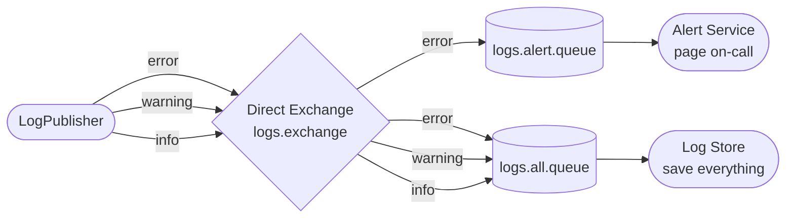

# Lesson 05 — Routing with a Direct Exchange

> **Goal:** Route messages selectively — some queues get only errors, others get everything. Understand how a single direct exchange can serve multiple queues with different routing keys, and what happens when there is no matching binding.

---

## What We're Building



**Scenario:** A logging system. Every log level goes to a persistent store, but only errors page the on-call engineer.

---

## How This Differs from Fanout

| Fanout (Lesson 04) | Direct Routing (This Lesson) |
|--------------------|------------------------------|
| Routing key **ignored** | Routing key **must match exactly** |
| Every bound queue gets every message | Only queues with a **matching binding** get the message |
| No control over who gets what | Fine-grained control — different keys → different queues |

You already used a direct exchange in Lesson 02, but with only one queue and one routing key. Now you'll see what makes it powerful: **one exchange, many queues, each subscribed to different keys**.

---

## Two Things to Know Before Writing Code

**1. A queue can have multiple bindings on the same exchange.**

`logs.all.queue` binds to `logs.exchange` three times — once for `error`, once for `warning`, once for `info`. It receives everything.

**2. Multiple queues can bind with the same routing key.**

Both `logs.all.queue` and `logs.alert.queue` bind to `logs.exchange` with the key `error`. When an error arrives, both queues receive a copy — just like fanout, but only for that one key.

---

## Step 1 — Add the Routing Configuration

Add to `RabbitMQConfig.java`:

```java
public static final String LOGS_EXCHANGE  = "logs.exchange";
public static final String LOG_QUEUE      = "logs.all.queue";
public static final String ALERT_QUEUE    = "logs.alert.queue";

public static final String KEY_ERROR   = "error";
public static final String KEY_WARNING = "warning";
public static final String KEY_INFO    = "info";

@Bean
public DirectExchange logsExchange() {
    return new DirectExchange(LOGS_EXCHANGE);
}

@Bean
public Queue logQueue() {
    return new Queue(LOG_QUEUE, true);
}

@Bean
public Queue alertQueue() {
    return new Queue(ALERT_QUEUE, true);
}

// logs.all.queue receives all three levels
@Bean
public Binding logBindingError() {
    return BindingBuilder.bind(logQueue()).to(logsExchange()).with(KEY_ERROR);
}

@Bean
public Binding logBindingWarning() {
    return BindingBuilder.bind(logQueue()).to(logsExchange()).with(KEY_WARNING);
}

@Bean
public Binding logBindingInfo() {
    return BindingBuilder.bind(logQueue()).to(logsExchange()).with(KEY_INFO);
}

// logs.alert.queue receives only errors
@Bean
public Binding alertBindingError() {
    return BindingBuilder.bind(alertQueue()).to(logsExchange()).with(KEY_ERROR);
}
```

**Notice:** `logsExchange()` returns a `DirectExchange` — the same type as in Lesson 02. Nothing new here. What's new is the number of bindings and the number of queues.

---

## Step 2 — Write the Log Publisher

Create `src/main/java/com/javaguy/springrabbitmq/producer/LogPublisher.java`:

```java
@Component
public class LogPublisher {

    private final RabbitTemplate rabbitTemplate;

    public LogPublisher(RabbitTemplate rabbitTemplate) {
        this.rabbitTemplate = rabbitTemplate;
    }

    public void log(String level, String message) {
        System.out.println("[Publisher] " + level.toUpperCase() + " — " + message);
        rabbitTemplate.convertAndSend(LOGS_EXCHANGE, level, message);
    }
}
```

The routing key is the log level string (`"error"`, `"warning"`, `"info"`). The exchange uses it to decide which queues receive the message.

---

## Step 3 — Write the Subscribers

Create `src/main/java/com/javaguy/springrabbitmq/consumer/LogSubscribers.java`:

```java
@Component
public class LogSubscribers {

    @RabbitListener(queues = LOG_QUEUE)
    public void onLog(String message) {
        System.out.println("[Log Store  ] Persisting  : " + message);
    }

    @RabbitListener(queues = ALERT_QUEUE)
    public void onAlert(String message) {
        System.out.println("[Alert      ] Paging on-call for: " + message);
    }
}
```

`onLog` processes everything. `onAlert` only fires for errors — not because of anything in the consumer, but because `logs.alert.queue` only has an `error` binding. The exchange does the filtering, not the consumer.

---

## Step 4 — Add a REST Endpoint

Create `src/main/java/com/javaguy/springrabbitmq/controller/LogController.java`:

```java
@RestController
@RequestMapping("/api/logs")
public class LogController {

    private final LogPublisher logPublisher;

    public LogController(LogPublisher logPublisher) {
        this.logPublisher = logPublisher;
    }

    @PostMapping
    public ResponseEntity<String> log(
            @RequestParam String level,
            @RequestParam String message) {
        logPublisher.log(level, message);
        return ResponseEntity.ok("Logged [" + level + "]: " + message);
    }
}
```

---

## Step 5 — Run and Observe

Start the app. Go to `http://localhost:15672` → **Exchanges** → `logs.exchange` → **Bindings**.

You'll see four bindings:

```
logs.all.queue   ← error
logs.all.queue   ← warning
logs.all.queue   ← info
logs.alert.queue ← error
```

Now test each level:

```bash
# Info — only Log Store should fire
curl -X POST "http://localhost:8081/api/logs?level=info&message=App+started"

# Warning — only Log Store should fire
curl -X POST "http://localhost:8081/api/logs?level=warning&message=Disk+at+80+percent"

# Error — both Log Store AND Alert should fire
curl -X POST "http://localhost:8081/api/logs?level=error&message=Database+connection+lost"
```

Expected console output for the error:

```
[Publisher] ERROR — Database connection lost
[Log Store  ] Persisting  : Database connection lost
[Alert      ] Paging on-call for: Database connection lost
```

For info and warning, only `[Log Store]` fires.

---

## Step 6 — See What Happens with No Matching Binding

Send a message with a routing key that has no binding:

```bash
curl -X POST "http://localhost:8081/api/logs?level=debug&message=Variable+x+is+42"
```

Watch the console — nothing. The exchange finds no queue bound to `"debug"` and silently drops the message. No error, no exception.

Go to the management UI → **Queues**. Both queues still show 0 ready messages. The message is gone.

**This is a common gotcha in production:** a typo in a routing key — or a binding you forgot to create — causes messages to vanish with no indication something went wrong. You'll solve this in a later lesson with publisher confirms and the `mandatory` flag, which tells RabbitMQ to return unroutable messages to the producer instead of dropping them.

---

## Step 7 — Add a New Level Without Changing the Consumers

Want a `critical` level that goes to both queues and also to a dedicated pager queue?

Add to `RabbitMQConfig.java`:

```java
public static final String PAGER_QUEUE  = "logs.pager.queue";
public static final String KEY_CRITICAL = "critical";

@Bean
public Queue pagerQueue() {
    return new Queue(PAGER_QUEUE, true);
}

@Bean
public Binding logBindingCritical() {
    return BindingBuilder.bind(logQueue()).to(logsExchange()).with(KEY_CRITICAL);
}

@Bean
public Binding alertBindingCritical() {
    return BindingBuilder.bind(alertQueue()).to(logsExchange()).with(KEY_CRITICAL);
}

@Bean
public Binding pagerBindingCritical() {
    return BindingBuilder.bind(pagerQueue()).to(logsExchange()).with(KEY_CRITICAL);
}
```

And a new subscriber in `LogSubscribers.java`:

```java
@RabbitListener(queues = PAGER_QUEUE)
public void onPager(String message) {
    System.out.println("[Pager      ] Sending SMS alert: " + message);
}
```

Restart and send:

```bash
curl -X POST "http://localhost:8081/api/logs?level=critical&message=Production+is+down"
```

Three services react. `LogPublisher` didn't change. The existing consumers didn't change. You only added config and a new listener.

---

## What You Should Understand by Now

- The routing key in a direct exchange must **exactly match** the binding key — one character off and the message goes nowhere.
- A queue can hold **multiple bindings** to the same exchange, each with a different key — this is how `logs.all.queue` receives all three levels.
- Multiple queues can share the **same routing key** — this is how both `LOG_QUEUE` and `ALERT_QUEUE` receive errors (similar to fanout, but scoped to one key).
- **No matching binding = silent drop** — unlike a bad HTTP call, there's no 404. Messages disappear without a trace unless you configure publisher returns.
- The exchange does the filtering — consumers don't need `if (level.equals("error"))` logic. Keep routing logic in the exchange config, not in consumer code.

---

## Exercises Before Moving On

---

**1. Send a message with `level=warning`. Go to the management UI → Queues. Which queues have a message ready, and which don't? Why?**

<details>
<summary>Reveal answer</summary>

Only `logs.all.queue` has a message ready. `logs.alert.queue` has nothing — it only has an `error` binding, so the warning message never reached it.

This confirms that the routing key controls delivery at the exchange level. The `onAlert` consumer in your code never got a chance to even see the warning message.

</details>

---

**2. In the management UI, add a new binding: `logs.alert.queue` ← `warning`. Now send a warning. Does the Alert Service fire?**

<details>
<summary>Reveal answer</summary>

Yes — without restarting the app or changing any code. Bindings are live configuration. The moment you add the binding, the exchange starts routing `warning` messages to `logs.alert.queue`.

This is useful in production for emergency routing changes — you can add a temporary binding to capture specific messages for debugging, then remove it when done.

</details>

---

**3. Change `LogPublisher` to send with routing key `"ERROR"` (uppercase) instead of `"error"`. Does `logs.all.queue` still receive the message?**

<details>
<summary>Reveal answer</summary>

No. Direct exchange matching is **case-sensitive**. `"ERROR"` does not match the binding key `"error"`. The message is silently dropped.

This is an easy production bug: a routing key constant defined as `"Error"` in one service and `"error"` in another means messages disappear with no error thrown. Always use shared constants (like `KEY_ERROR`) across producers and consumers in the same codebase — never hardcode routing key strings in multiple places.

</details>

---

**4. What is the practical difference between binding `logs.all.queue` to `logs.exchange` with keys `error`, `warning`, `info` vs binding it to a fanout exchange?**

<details>
<summary>Reveal answer</summary>

With the fanout exchange, `logs.all.queue` would receive **every** message published to that exchange — including any future keys like `debug` or `trace`, even ones you haven't thought of yet.

With the direct exchange + explicit bindings, `logs.all.queue` only receives the keys you've bound it to. Adding a new key (`debug`) requires a new binding — nothing gets through unless you explicitly wire it up.

Which is better depends on the use case. Fanout is simpler when you genuinely want everything. Direct gives you control when you want to be deliberate about what reaches each queue — especially important when some queues are expensive to process (like the alert queue that wakes someone up).

</details>

---

## Checkpoint

- [ ] Why does a direct exchange drop a message when no binding matches — and why is that silent?
- [ ] How does a queue receive messages for multiple routing keys on the same direct exchange?
- [ ] If two queues are bound to the same routing key, how many copies of the message are delivered?
- [ ] Where should routing logic live — in the exchange bindings, or inside consumer code?

---

## Next

`06-topics.md` — Use a Topic Exchange with wildcard patterns (`*` and `#`) to route messages more flexibly than direct matching allows. One binding can match entire families of routing keys.
