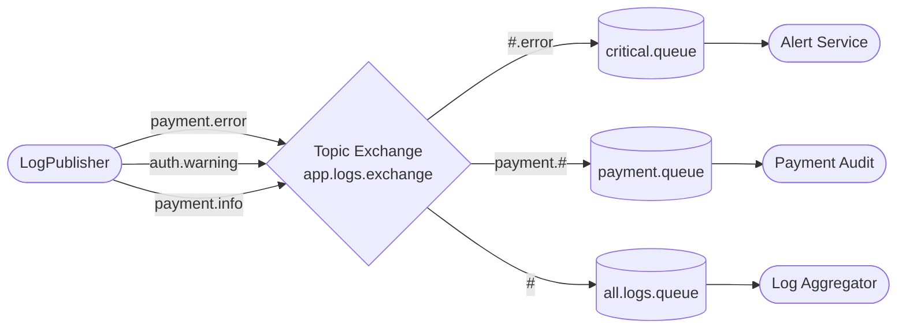

# Lesson 06 — Topic Exchange

> **Goal:** Route messages using wildcard patterns instead of exact key matching. One binding covers an entire family of routing keys — without listing every possible value upfront.

---

## What We're Building



**Scenario:** Application logs with a two-part routing key: `<service>.<level>`. Route all errors regardless of service, all payment logs regardless of level, and everything to a central aggregator — with just three bindings.

---

## Why Direct Exchange Isn't Enough

In Lesson 05, the routing key was just the level (`error`, `warning`, `info`). That works fine until requirements grow:

- You want all errors, regardless of which service they came from
- You want all payment logs, regardless of level
- You want logs from a specific region and service together

With a direct exchange, you'd need a separate binding for every combination: `payment.error`, `auth.error`, `orders.error`... every time you add a new service, you add more bindings manually.

A topic exchange lets one binding cover all of those with a pattern.

---

## The Two Wildcards

Topic exchange routing keys are dot-separated words: `payment.error`, `eu.orders.warning`, `auth.info`.

Two wildcard characters work in binding patterns:

| Wildcard | Matches |
|----------|---------|
| `*` | Exactly **one** word |
| `#` | **Zero or more** words |

**Examples with key `payment.error.critical`:**

| Binding Pattern | Matches? | Why |
|----------------|----------|-----|
| `payment.error.critical` | Yes | Exact match |
| `payment.*.*` | Yes | `*` matches one word each |
| `payment.#` | Yes | `#` matches `error.critical` |
| `#.critical` | Yes | `#` matches `payment.error` |
| `#` | Yes | `#` matches everything |
| `payment.*` | **No** | `*` matches exactly one word — `error.critical` is two |
| `*.error.*` | Yes | Middle `*` matches `error` exactly |

> **Rule of thumb:** Use `*` when you know exactly how many words will be in that position. Use `#` when the number of words can vary, or when you want to match a suffix/prefix regardless of length.

---

## Step 1 — Add the Topic Configuration

Add to `RabbitMQConfig.java`:

```java
public static final String TOPIC_EXCHANGE   = "app.logs.exchange";
public static final String CRITICAL_QUEUE   = "logs.critical.queue";
public static final String PAYMENT_QUEUE    = "logs.payment.queue";
public static final String ALL_LOGS_QUEUE   = "logs.all.queue";

@Bean
public TopicExchange topicExchange() {
    return new TopicExchange(TOPIC_EXCHANGE);
}

@Bean
public Queue criticalQueue() {
    return new Queue(CRITICAL_QUEUE, true);
}

@Bean
public Queue paymentQueue() {
    return new Queue(PAYMENT_QUEUE, true);
}

@Bean
public Queue allLogsQueue() {
    return new Queue(ALL_LOGS_QUEUE, true);
}

// All errors, any service: *.error or #.error
@Bean
public Binding criticalBinding() {
    return BindingBuilder.bind(criticalQueue()).to(topicExchange()).with("#.error");
}

// All payment logs, any level: payment.#
@Bean
public Binding paymentBinding() {
    return BindingBuilder.bind(paymentQueue()).to(topicExchange()).with("payment.#");
}

// Everything: #
@Bean
public Binding allLogsBinding() {
    return BindingBuilder.bind(allLogsQueue()).to(topicExchange()).with("#");
}
```

> **Import you'll need:**
> ```java
> import org.springframework.amqp.core.TopicExchange;
> ```

---

## Step 2 — Write the Publisher

Create `src/main/java/com/javaguy/springrabbitmq/producer/AppLogPublisher.java`:

```java
@Component
public class AppLogPublisher {

    private final RabbitTemplate rabbitTemplate;

    public AppLogPublisher(RabbitTemplate rabbitTemplate) {
        this.rabbitTemplate = rabbitTemplate;
    }

    public void publish(String routingKey, String message) {
        System.out.println("[Publisher] key=" + routingKey + " | " + message);
        rabbitTemplate.convertAndSend(TOPIC_EXCHANGE, routingKey, message);
    }
}
```

The routing key is now a structured string the caller constructs — `"payment.error"`, `"auth.info"`, etc.

---

## Step 3 — Write the Subscribers

Create `src/main/java/com/javaguy/springrabbitmq/consumer/AppLogSubscribers.java`:

```java
@Component
public class AppLogSubscribers {

    @RabbitListener(queues = CRITICAL_QUEUE)
    public void onCritical(String message) {
        System.out.println("[Alert Service  ] ERROR detected: " + message);
    }

    @RabbitListener(queues = PAYMENT_QUEUE)
    public void onPayment(String message) {
        System.out.println("[Payment Audit  ] Payment log  : " + message);
    }

    @RabbitListener(queues = ALL_LOGS_QUEUE)
    public void onAllLogs(String message) {
        System.out.println("[Log Aggregator ] Storing      : " + message);
    }
}
```

---

## Step 4 — Add a REST Endpoint

Create `src/main/java/com/javaguy/springrabbitmq/controller/AppLogController.java`:

```java
@RestController
@RequestMapping("/api/app-logs")
public class AppLogController {

    private final AppLogPublisher appLogPublisher;

    public AppLogController(AppLogPublisher appLogPublisher) {
        this.appLogPublisher = appLogPublisher;
    }

    @PostMapping
    public ResponseEntity<String> log(
            @RequestParam String key,
            @RequestParam String message) {
        appLogPublisher.publish(key, message);
        return ResponseEntity.ok("Published [" + key + "]: " + message);
    }
}
```

---

## Step 5 — Run and Observe

Start the app. Go to `http://localhost:15672` → **Exchanges** → `app.logs.exchange` → **Bindings**.

You'll see three bindings with their patterns listed:

```
logs.critical.queue  ← #.error
logs.payment.queue   ← payment.#
logs.all.queue       ← #
```

Now test each scenario:

```bash
# payment.error — matches all three bindings
curl -X POST "http://localhost:8081/api/app-logs?key=payment.error&message=Card+declined"

# auth.warning — matches only #
curl -X POST "http://localhost:8081/api/app-logs?key=auth.warning&message=Failed+login+attempt"

# payment.info — matches payment.# and #
curl -X POST "http://localhost:8081/api/app-logs?key=payment.info&message=Payment+initiated"

# orders.error — matches #.error and #
curl -X POST "http://localhost:8081/api/app-logs?key=orders.error&message=Order+failed"
```

**Expected output for `payment.error`:**

```
[Publisher]        key=payment.error | Card declined
[Alert Service  ]  ERROR detected: Card declined
[Payment Audit  ]  Payment log  : Card declined
[Log Aggregator ]  Storing      : Card declined
```

All three fire because `payment.error` matches `#.error`, `payment.#`, and `#`.

**Expected output for `auth.warning`:**

```
[Publisher]        key=auth.warning | Failed login attempt
[Log Aggregator ]  Storing      : Failed login attempt
```

Only the aggregator fires — `auth.warning` doesn't match `#.error` (doesn't end in `.error`) and doesn't match `payment.#` (doesn't start with `payment.`).

---

## Step 6 — Test the `*` vs `#` Difference

Add a temporary binding in the management UI to make this concrete.

Go to **Exchanges** → `app.logs.exchange` → **Bindings**. Add:
- Destination: `logs.critical.queue`
- Routing key: `*.error`

Now test:

```bash
# One word before .error — matches *.error
curl -X POST "http://localhost:8081/api/app-logs?key=payment.error&message=Test+A"

# Two words before .error — does NOT match *.error
curl -X POST "http://localhost:8081/api/app-logs?key=eu.payment.error&message=Test+B"
```

`Test A` fires the alert twice (once for `#.error`, once for `*.error`). `Test B` only fires once — `*.error` requires exactly one word before `.error`, but `eu.payment` is two words.

Remove the temporary binding when done.

---

## What You Should Understand by Now

- `*` matches **one word exactly** — the number of words in the key must match the number of `*` placeholders.
- `#` matches **any number of words** including zero — `#` alone matches every key ever published.
- A topic exchange subsumes both direct and fanout behaviour: exact patterns act like direct, `#` alone acts like fanout.
- **Pattern design matters at architecture time** — once producers are publishing `service.level` keys in production, you can't easily restructure them. Choose your key schema deliberately.

---

## Exercises Before Moving On

---

**1. What routing key patterns would you use to bind a queue that should receive logs only from the `eu` region, at error level, for any service? The key format is `<region>.<service>.<level>`.**

<details>
<summary>Reveal answer</summary>

`eu.*.error` — `eu` is a literal match, `*` matches any single service name, `error` is a literal match.

`eu.#.error` would also work if service names could be multi-word, but `eu.*.error` is more precise and makes the expected key structure explicit in the binding.

`eu.#` would match all EU logs regardless of level — not what was asked, but a common pattern for regional aggregation.

</details>

---

**2. Publish with key `payment`. Does `payment.#` match it?**

<details>
<summary>Reveal answer</summary>

Yes — `#` matches **zero or more words**, so `payment.#` matches the single word `payment` (zero words after `payment.`).

This surprises most people. `payment.*` would NOT match `payment` because `*` requires exactly one word. So if your keys can sometimes be just `payment` and sometimes `payment.info`, use `payment.#` in your binding — not `payment.*`.

</details>

---

**3. You have three services: `orders`, `auth`, `payments`. Each publishes at levels `info`, `warning`, `error`. How many bindings would you need with a direct exchange to give one queue all errors from all services? How many with a topic exchange?**

<details>
<summary>Reveal answer</summary>

**Direct exchange:** 3 bindings — one for `orders.error`, one for `auth.error`, one for `payments.error`. Add a fourth service → add another binding.

**Topic exchange:** 1 binding — `#.error`. Covers all services now and any new ones added in the future. No binding change needed when a new service is added.

This is the core value of a topic exchange: the number of bindings stays constant even as the system grows.

</details>

---

**4. What would happen if you published with key `payment.error.critical`? Would `#.error` still match?**

<details>
<summary>Reveal answer</summary>

No. `#.error` matches keys that **end with the word `error`**. The key `payment.error.critical` ends with `critical`, not `error`, so it does not match `#.error`.

It would match `payment.#`, `#`, and `#.critical` — but not `#.error`.

This is easy to get wrong. `#.error` does not mean "contains the word error somewhere" — it means "ends with the word error". If you want to match `error` anywhere in the key, you'd need `#.error.#`, but that's unusual and fragile to maintain.

</details>

---

## Checkpoint

- [ ] What is the difference between `*` and `#` in a topic binding pattern?
- [ ] Does `payment.#` match the key `payment` (no suffix)? Does `payment.*`?
- [ ] How does a topic exchange with pattern `#` behave — what does it look like?
- [ ] When would you choose a topic exchange over a direct exchange?

---

## Next

`07-publisher-confirms.md` — Guarantee that messages actually reach RabbitMQ. Add a confirm callback so the producer knows when a message is safely stored — and what to do when it isn't.
