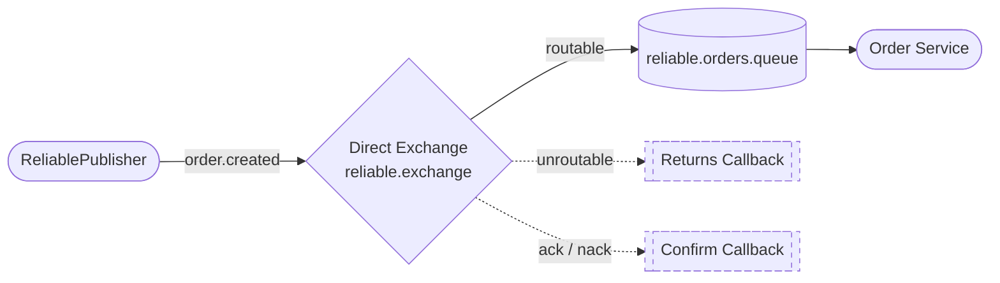

# Lesson 07 — Publisher Confirms & Returns

> **Goal:** Know for certain that a message reached RabbitMQ — and find out immediately when it didn't. Add a **confirm callback** so the broker acknowledges every message, and a **returns callback** so you catch messages that can't be routed to any queue.

---

## What We're Building

A small, self-contained **orders** flow so we can watch confirms and returns fire in isolation — one direct exchange, one queue, one binding, one consumer.



**Scenario:** So far every `convertAndSend` has been fire-and-forget. The method returns `void`, and we *assumed* the message landed safely. This lesson makes that assumption visible: the broker tells us `ack` (stored) or `nack` (rejected), and warns us when a message had nowhere to go. We publish `order.created` (routable — the consumer receives it) and `order.cancelled` (unroutable — no binding matches, so the return callback fires).

---

## The Problem With Fire-and-Forget

Look at what we've been doing since Lesson 02:

```java
rabbitTemplate.convertAndSend(TOPIC_EXCHANGE, routingKey, message);
```

This call returns as soon as the message leaves the application. It tells you **nothing** about what happened next. Three things can silently go wrong:

1. **The broker never received it** — connection dropped mid-send, RabbitMQ was restarting.
2. **The broker received it but couldn't store it** — an internal error, disk full, an exception in the exchange.
3. **The message was accepted but routed nowhere** — you published with a routing key that matches no binding. The exchange happily drops it on the floor.

Case 3 is the sneaky one. RabbitMQ does **not** error when a message is unroutable — by default it just discards it. Your producer thinks it succeeded. The message simply vanishes.

Publisher confirms and returns close both gaps.

---

## Two Separate Mechanisms

These are often confused. They answer different questions.

| Mechanism | Question it answers | Fires when |
|-----------|--------------------|-----------|
| **Publisher Confirm** | Did the **broker** accept my message? | Always — one `ack` or `nack` per message |
| **Publisher Return** | Could my message be **routed** to a queue? | Only when a message is **unroutable** |

A message can be **confirmed (`ack`) and returned** at the same time: the broker accepted it, but no binding matched, so it handed the message back before dropping it. Confirm = "I got it." Return = "…but I had nowhere to put it."

> **Rule of thumb:** Confirms tell you the broker is alive and accepted the message. Returns tell you your routing key is wrong. You almost always want both on.

---

## Step 1 — Enable Confirms and Returns

Turn both features on in `application.yml`. They're off by default because they add a small amount of overhead.

```yaml
spring:
  rabbitmq:
    host: localhost
    port: 5672
    username: guest
    password: guest
    publisher-confirm-type: correlated
    publisher-returns: true
```

**`publisher-confirm-type`** has three values:

| Value | Meaning |
|-------|---------|
| `none` | Confirms disabled (the default) |
| `correlated` | Confirms enabled, and each confirm carries a `CorrelationData` so you know **which** message it belongs to |
| `simple` | Confirms enabled but without correlation — older, blocking style. Avoid it. |

Use `correlated`. Without correlation you get an `ack` but no way to tell which message it was for — useless once more than one message is in flight.

**`publisher-returns: true`** enables the returns callback. It only works together with the `mandatory` flag (Step 3).

---

## Step 2 — Add the Reliable Exchange

We give this lesson its own exchange, queue, and binding so nothing here overlaps with earlier lessons. A **direct** exchange is perfect: routing is exact-match, so "routable" vs "unroutable" is unambiguous.

Add to `RabbitMQConfig.java`:

```java
public static final String RELIABLE_EXCHANGE = "reliable.exchange";
public static final String RELIABLE_QUEUE    = "reliable.orders.queue";

@Bean
public DirectExchange reliableExchange() {
    return new DirectExchange(RELIABLE_EXCHANGE);
}

@Bean
public Queue reliableQueue() {
    return new Queue(RELIABLE_QUEUE, true);
}

@Bean
public Binding reliableBinding() {
    return BindingBuilder.bind(reliableQueue()).to(reliableExchange()).with("order.created");
}
```

> **Import you'll need:**
> ```java
> import org.springframework.amqp.core.DirectExchange;
> ```

One binding: `order.created` → `reliable.orders.queue`. A message published with `order.created` is routable; anything else (like `order.cancelled`) matches no binding and is unroutable — that's what triggers the return callback later.

---

## Step 3 — Create the `RabbitTemplateConfig`

The callbacks live on the `RabbitTemplate`, and they must be set on the exact instance you publish through. So we declare our **own** `RabbitTemplate` bean with both callbacks attached.

Create `src/main/java/com/javaguy/springrabbitmq/config/RabbitTemplateConfig.java`:

```java
package com.javaguy.springrabbitmq.config;

import org.springframework.amqp.rabbit.connection.ConnectionFactory;
import org.springframework.amqp.rabbit.core.RabbitTemplate;
import org.springframework.context.annotation.Bean;
import org.springframework.context.annotation.Configuration;

@Configuration
public class RabbitTemplateConfig {

    @Bean
    public RabbitTemplate rabbitTemplate(ConnectionFactory connectionFactory) {
        RabbitTemplate rabbitTemplate = new RabbitTemplate(connectionFactory);

        // Fires for EVERY message: ack (accepted) or nack (rejected)
        rabbitTemplate.setConfirmCallback((correlationData, ack, cause) -> {
            String id = correlationData != null ? correlationData.getId() : "Unknown";
            if (ack) {
                IO.println("[Confirm] ACK  id=" + id + " — broker stored the message");
            } else {
                IO.println("[Confirm] NACK id=" + id + " — broker rejected it: " + cause);
            }
        });

        // Fires ONLY when a message is unroutable
        rabbitTemplate.setReturnsCallback(returned -> {
            IO.println("[Return ] UNROUTABLE key=" + returned.getRoutingKey()
                    + " reply=" + returned.getReplyText()
                    + " body=" + new String(returned.getMessage().getBody()));
        });

        // Required for the returns callback to fire on unroutable messages
        rabbitTemplate.setMandatory(true);

        return rabbitTemplate;
    }
}
```

> **Why declare our own template?** Spring Boot auto-configures a `RabbitTemplate` for free, but you can't attach callbacks to an instance you never see. Declaring your own bean guarantees every publisher injects the one with callbacks attached — Spring backs off its auto-configuration the moment you define a `RabbitTemplate` bean.

**The confirm callback signature:**
- `correlationData` — the tag you attach when publishing (Step 4). Null if you didn't attach one.
- `ack` — `true` = broker stored it, `false` = broker rejected it.
- `cause` — a human-readable reason, populated only on `nack`.

**`setMandatory(true)`** is what makes returns work. It tells the broker: "if this message can't be routed to at least one queue, hand it back to me instead of silently discarding it." That handback is exactly what triggers the returns callback. Without it, an unroutable message vanishes and the callback never runs — even with `publisher-returns: true` set in Step 1.

---

## Step 4 — Write the Publisher

To know *which* message a confirm belongs to, attach a `CorrelationData` when you send. Give each message a unique id — a UUID works well.

Create `src/main/java/com/javaguy/springrabbitmq/producer/ReliablePublisher.java`:

```java
package com.javaguy.springrabbitmq.producer;

import static com.javaguy.springrabbitmq.config.RabbitMQConfig.RELIABLE_EXCHANGE;

import java.util.UUID;

import org.springframework.amqp.rabbit.connection.CorrelationData;
import org.springframework.amqp.rabbit.core.RabbitTemplate;
import org.springframework.stereotype.Component;

@Component
public class ReliablePublisher {

    private final RabbitTemplate rabbitTemplate;

    public ReliablePublisher(RabbitTemplate rabbitTemplate) {
        this.rabbitTemplate = rabbitTemplate;
    }

    public void publish(String routingKey, String message) {
        CorrelationData correlationData = new CorrelationData(UUID.randomUUID().toString());
        IO.println("[Publisher] sending id=" + correlationData.getId() + " key=" + routingKey);
        rabbitTemplate.convertAndSend(RELIABLE_EXCHANGE, routingKey, message, correlationData);
    }
}
```

The `CorrelationData` is the **last** argument to `convertAndSend`. That same id comes back to your confirm callback, so you can match the `ack`/`nack` to the exact message you sent. Injecting `RabbitTemplate` gives you the callback-wired bean from Step 3 — no extra wiring needed.

---

## Step 5 — Write the Consumer

So we can see a routed message actually arrive, add a listener on the reliable queue.

Create `src/main/java/com/javaguy/springrabbitmq/consumer/ReliableOrderConsumer.java`:

```java
package com.javaguy.springrabbitmq.consumer;

import static com.javaguy.springrabbitmq.config.RabbitMQConfig.RELIABLE_QUEUE;

import org.springframework.amqp.rabbit.annotation.RabbitListener;
import org.springframework.stereotype.Component;

@Component
public class ReliableOrderConsumer {

    @RabbitListener(queues = RELIABLE_QUEUE)
    public void onOrder(String message) {
        IO.println("[Order Service] received: " + message);
    }
}
```

This is the piece that makes the difference concrete: when the confirm says `ACK` **and** this line prints, the message was routed and delivered. When the confirm says `ACK` but this line stays silent (and a return fires instead), the message was accepted by the broker but reached no queue.

---

## Step 6 — Add a REST Endpoint

Create `src/main/java/com/javaguy/springrabbitmq/controller/ReliableOrderController.java`:

```java
package com.javaguy.springrabbitmq.controller;

import org.springframework.http.ResponseEntity;
import org.springframework.web.bind.annotation.PostMapping;
import org.springframework.web.bind.annotation.RequestMapping;
import org.springframework.web.bind.annotation.RequestParam;
import org.springframework.web.bind.annotation.RestController;

import com.javaguy.springrabbitmq.producer.ReliablePublisher;

@RestController
@RequestMapping("/api/reliable-orders")
public class ReliableOrderController {

    private final ReliablePublisher reliablePublisher;

    public ReliableOrderController(ReliablePublisher reliablePublisher) {
        this.reliablePublisher = reliablePublisher;
    }

    @PostMapping
    public ResponseEntity<String> publish(
            @RequestParam String key,
            @RequestParam String message) {
        reliablePublisher.publish(key, message);
        return ResponseEntity.ok("Published [" + key + "]: " + message);
    }
}
```

The `key` query param becomes the routing key, `message` becomes the body — in that order, matching `publish(routingKey, message)`.

---

## Step 7 — Run and Observe

Start the app and RabbitMQ (`docker compose up -d`).

**Test A — a routable message (happy path).** `order.created` matches our binding:

```bash
curl -X POST "http://localhost:8081/api/reliable-orders?key=order.created&message=Order+42+placed"
```

Expected output — the publisher sends, the broker confirms, the consumer receives:

```
[Publisher] sending id=8f3c... key=order.created
[Order Service] received: Order 42 placed
[Confirm] ACK  id=8f3c... — broker stored the message
```

No return fires: the message routed successfully to `reliable.orders.queue`.

**Test B — an unroutable message.** `order.cancelled` matches **no** binding on the exchange:

```bash
curl -X POST "http://localhost:8081/api/reliable-orders?key=order.cancelled&message=Nowhere+to+go"
```

Now you see a return **and** a confirm — but the consumer stays silent:

```
[Publisher] sending id=1a2b... key=order.cancelled
[Return ] UNROUTABLE key=order.cancelled reply=NO_ROUTE body=Nowhere to go
[Confirm] ACK  id=1a2b... — broker stored the message
```

Read that carefully — this is the whole lesson in three lines:

- The **return** fired: no binding matched `order.cancelled`, so the broker handed it back.
- The **confirm** still says `ACK`: the broker *did* accept the message from the network. Acceptance is not the same as routing.
- The **consumer never ran**: the message reached no queue, so no one received it. With `mandatory` off, Test B would print only the `ACK` — and you'd never know the message was lost.

> **Ordering note:** the return arrives *before* the confirm. The broker returns the unroutable message first, then acknowledges it. Don't rely on the confirm to tell you routing failed — that's the return's job.

---

## Step 8 — Trigger a NACK (Optional)

A `nack` (broker rejected the message) is rarer and harder to force on purpose — it usually signals a broker-side problem like a full disk or an internal error. You can simulate the *handling* path by publishing to an exchange that doesn't exist:

```java
rabbitTemplate.convertAndSend("exchange.that.does.not.exist", "any.key", "test", correlationData);
```

Depending on broker version this surfaces as a channel error rather than a clean `nack`, so treat this step as illustration only. The key takeaway: **your `nack` branch is where retry, alerting, or persisting-to-a-fallback-store logic belongs.** In production that branch is not just a log line.

---

## What You Should Understand by Now

- `convertAndSend` is fire-and-forget by default — it returns `void` and hides all three failure modes.
- **Confirms** answer "did the broker accept it?" — one `ack` or `nack` per message. Enable with `publisher-confirm-type: correlated`.
- **Returns** answer "could it be routed?" — fire only for unroutable messages, and only when `mandatory` is set.
- A message can be **ack'd and returned at once**: accepted by the broker but routed nowhere.
- `CorrelationData` is how you match an async confirm back to the specific message you sent.
- The `nack` and return branches are where real reliability logic lives — retry, alert, or park the message. A log line is the starting point, not the destination.

---

## Exercises Before Moving On

---

**1. A message comes back with `ack=true` in the confirm callback AND fires the returns callback. Was the message delivered to a consumer?**

<details>
<summary>Reveal answer</summary>

No. `ack=true` only means the **broker accepted** the message off the network. The returns callback firing means it matched **no binding**, so it reached no queue and therefore no consumer. The broker handed it back before discarding it.

This is the single most misunderstood point about confirms: acceptance ≠ routing ≠ delivery. A confirm proves the first, a return disproves the second.

</details>

---

**2. You enabled `publisher-confirm-type: correlated` but forgot `publisher-returns: true`. You publish with a bad routing key. What happens?**

<details>
<summary>Reveal answer</summary>

You get an `ack` in the confirm callback and **nothing else**. The message is silently dropped — the returns callback never fires because returns weren't enabled.

Worse than that: even with `publisher-returns: true`, if the message wasn't sent with `mandatory` set, the return still won't fire. You need **both** the property and the `mandatory` flag for unroutable messages to come back.

</details>

---

**3. Why use `correlated` instead of `simple` for the confirm type?**

<details>
<summary>Reveal answer</summary>

`correlated` attaches a `CorrelationData` to each message, so when the async `ack`/`nack` arrives you know exactly which message it refers to. With multiple messages in flight that identity is essential — otherwise an `ack` is just "something was accepted," with no way to know what.

`simple` uses an older, blocking `waitForConfirms()` style that stalls the publishing thread. `correlated` is fully asynchronous and is the modern default.

</details>

---

**4. The confirm callback runs on a different thread than the one that called `convertAndSend`. Why does that matter?**

<details>
<summary>Reveal answer</summary>

Because the callback is **asynchronous** — your `publish` method returns immediately, and the `ack`/`nack` arrives later on a RabbitMQ-managed thread. You cannot `return` a success/failure result directly from `publish` based on the confirm.

Practically: don't block waiting for the confirm inside your request thread. If a caller genuinely needs to know the outcome before responding, you correlate the confirm back to the original request (e.g. via the `CorrelationData` id and a pending-map or a `CompletableFuture`) rather than expecting `convertAndSend` to tell you inline.

</details>

---

## Checkpoint

- [ ] What is the difference between a publisher **confirm** and a publisher **return**?
- [ ] Which two settings must both be on for an unroutable message to come back to you?
- [ ] Can a message be `ack`'d and returned at the same time? What does that combination mean?
- [ ] What does `CorrelationData` give you that `simple` confirms don't?
- [ ] Where does real reliability logic belong — and why isn't a log line enough?

---

## Next

`08-manual-acks.md` — Confirms protect the message on the way *in*. Manual consumer acknowledgements protect it on the way *out* — so a message isn't lost when a consumer crashes mid-processing. We'll switch a listener to `MANUAL` ack mode and decide when to `basicAck`, `basicNack`, and requeue.
