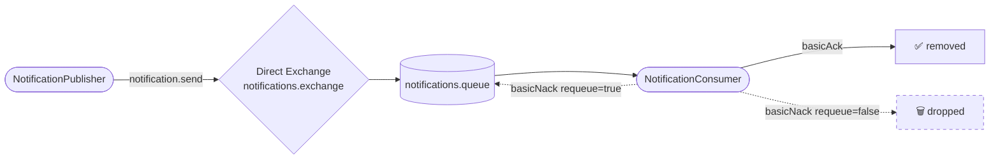

# Lesson 08 — Manual Acknowledgements

> **Goal:** Decide the fate of every message a consumer touches. Publisher confirms (Lesson 07) protect a message on the way *in*. Manual acks protect it on the way *out* — so nothing is lost when processing fails, and nothing loops forever when a message can never succeed.

---

## What We're Building

A **notifications** consumer that manually acknowledges every message and picks one of three outcomes per delivery: succeed, retry, or give up.



**Scenario:** A notification service that calls an external provider (SMS, email, push). Some sends succeed. Some fail *transiently* — the provider blipped, retry it. Some fail *permanently* — the payload is malformed, retrying will never help. The consumer has to tell RabbitMQ which case it's in.

---

## Recap — What Lesson 03 Already Showed

In Lesson 03 (Work Queues) you already met manual acks: `AcknowledgeMode.MANUAL`, `channel.basicAck(...)`, `channel.basicNack(...)`, and the demo where killing a worker mid-task requeued the message. If that's fuzzy, skim Lesson 03 first.

This lesson is about the **decision** — not the mechanics. Once acks are manual, *your code* owns the fate of every message. Get that decision wrong in one direction and you lose messages; get it wrong in the other and you loop forever. This lesson makes that trade-off concrete and fixes the poison-message loop Lesson 03 warned about.

---

## At-Least-Once Delivery and the Three Outcomes

RabbitMQ gives you **at-least-once** delivery. A message stays in the queue as **Unacked** from the moment it's delivered until you acknowledge it. Three things can happen:

| Call | Meaning | Message ends up |
|------|---------|-----------------|
| `basicAck(tag, false)` | "Processed successfully." | Deleted |
| `basicNack(tag, false, true)` | "Failed — try again." | **Requeued** (redelivered) |
| `basicNack(tag, false, false)` | "Failed — don't try again." | **Dropped** (or dead-lettered, Lesson 09) |

> **The three booleans.** `basicNack(deliveryTag, multiple, requeue)`. The middle `multiple` acks/nacks every unacked message up to this tag at once — almost always `false` (one message at a time). The last `requeue` is the whole decision: put it back, or let it go. (`basicReject(tag, requeue)` is the same thing for a single message — `basicNack` is the batch-capable version.)

The hard part is choosing between the two nacks. Requeue a message that can **never** succeed and it comes straight back, fails again, and loops forever — the **poison message**. Drop a message that failed for a **transient** reason and you've thrown away good data. You need to tell the two apart.

---

## The Signal: the `redelivered` Flag

RabbitMQ marks every requeued message as **redelivered**. That flag is your cheapest retry counter: if a message arrives with `redelivered=true`, it has already failed at least once. A simple, robust policy for this lesson:

- **First failure** (`redelivered=false`) → assume transient → `nack` **requeue=true** (give it one more shot).
- **Failed again** (`redelivered=true`) → treat as poison → `nack` **requeue=false** (stop the loop).

That's a one-retry policy with no external state. In Lesson 09 we replace the final "drop" with a **Dead Letter Exchange** so poison messages land somewhere you can inspect them instead of vanishing.

---

## Step 1 — Add the Notifications Configuration

Add a dedicated exchange, queue, binding, and a **manual-ack container factory** to `RabbitMQConfig.java`:

```java
public static final String NOTIFICATIONS_EXCHANGE = "notifications.exchange";
public static final String NOTIFICATIONS_QUEUE    = "notifications.queue";
public static final String NOTIFICATIONS_KEY      = "notification.send";

@Bean
public DirectExchange notificationsExchange() {
    return new DirectExchange(NOTIFICATIONS_EXCHANGE);
}

@Bean
public Queue notificationsQueue() {
    return new Queue(NOTIFICATIONS_QUEUE, true);
}

@Bean
public Binding notificationsBinding() {
    return BindingBuilder.bind(notificationsQueue()).to(notificationsExchange()).with(NOTIFICATIONS_KEY);
}

@Bean(name = "manualAckContainerFactory")
public SimpleRabbitListenerContainerFactory manualAckContainerFactory(ConnectionFactory connectionFactory) {
    SimpleRabbitListenerContainerFactory factory = new SimpleRabbitListenerContainerFactory();
    factory.setConnectionFactory(connectionFactory);
    factory.setAcknowledgeMode(AcknowledgeMode.MANUAL);
    factory.setPrefetchCount(1);
    return factory;
}
```

> **Imports you'll need** (already present if you did Lesson 03):
> ```java
> import org.springframework.amqp.core.AcknowledgeMode;
> import org.springframework.amqp.rabbit.config.SimpleRabbitListenerContainerFactory;
> import org.springframework.amqp.rabbit.connection.ConnectionFactory;
> ```

`AcknowledgeMode.MANUAL` is the switch that hands you control: nothing is acked unless your code says so. `prefetchCount(1)` keeps things easy to follow — one in-flight message at a time.

---

## Step 2 — Write the Publisher

Create `src/main/java/com/javaguy/springrabbitmq/producer/NotificationPublisher.java`:

```java
package com.javaguy.springrabbitmq.producer;

import static com.javaguy.springrabbitmq.config.RabbitMQConfig.NOTIFICATIONS_EXCHANGE;
import static com.javaguy.springrabbitmq.config.RabbitMQConfig.NOTIFICATIONS_KEY;

import org.springframework.amqp.rabbit.core.RabbitTemplate;
import org.springframework.stereotype.Component;

@Component
public class NotificationPublisher {
    private final RabbitTemplate rabbitTemplate;

    public NotificationPublisher(RabbitTemplate rabbitTemplate) {
        this.rabbitTemplate = rabbitTemplate;
    }

    public void publish(String message) {
        IO.println("[Publisher] queuing notification: " + message);
        rabbitTemplate.convertAndSend(NOTIFICATIONS_EXCHANGE, NOTIFICATIONS_KEY, message);
    }
}
```

Nothing new on the producer side — the reliability decisions all live in the consumer.

---

## Step 3 — Write the Consumer

This is the heart of the lesson. Create `src/main/java/com/javaguy/springrabbitmq/consumer/NotificationConsumer.java`:

```java
package com.javaguy.springrabbitmq.consumer;

import static com.javaguy.springrabbitmq.config.RabbitMQConfig.NOTIFICATIONS_QUEUE;

import java.io.IOException;

import org.springframework.amqp.rabbit.annotation.RabbitListener;
import org.springframework.amqp.support.AmqpHeaders;
import org.springframework.messaging.handler.annotation.Header;
import org.springframework.stereotype.Component;

import com.rabbitmq.client.Channel;

@Component
public class NotificationConsumer {

    @RabbitListener(queues = NOTIFICATIONS_QUEUE, containerFactory = "manualAckContainerFactory")
    public void onNotification(
            String message,
            Channel channel,
            @Header(AmqpHeaders.DELIVERY_TAG) long deliveryTag,
            @Header(AmqpHeaders.REDELIVERED) boolean redelivered) throws IOException {

        IO.println("[Notifier] processing: " + message + " (redelivered=" + redelivered + ")");

        try {
            if (message.startsWith("FAIL")) {
                throw new IllegalStateException("delivery provider rejected the message");
            }
            IO.println("[Notifier] sent — ack");
            channel.basicAck(deliveryTag, false);
        } catch (Exception e) {
            if (redelivered) {
                IO.println("[Notifier] failed again — giving up (nack, no requeue): " + e.getMessage());
                channel.basicNack(deliveryTag, false, false);
            } else {
                IO.println("[Notifier] failed once — retry (nack, requeue): " + e.getMessage());
                channel.basicNack(deliveryTag, false, true);
            }
        }
    }
}
```

**What each piece does:**

| Code | Why it's here |
|------|---------------|
| `containerFactory = "manualAckContainerFactory"` | Uses the manual-ack factory from Step 1 — no auto-ack |
| `Channel channel` | The raw AMQP channel — you need it to ack/nack |
| `@Header(AmqpHeaders.DELIVERY_TAG) long deliveryTag` | The id of *this* delivery, required by every ack/nack |
| `@Header(AmqpHeaders.REDELIVERED) boolean redelivered` | The retry signal — `true` means it has failed before |
| `message.startsWith("FAIL")` | A deterministic stand-in for "the external provider rejected it" so you can trigger the failure path on demand |

> **The golden rule of manual ack:** every code path must end in exactly one `basicAck` or `basicNack`. Miss one — throw an uncaught exception, hit an early `return` — and the message stays **Unacked** forever (until the connection drops). That's why the `try` wraps everything and both `catch` branches nack.

---

## Step 4 — Add a REST Endpoint

Create `src/main/java/com/javaguy/springrabbitmq/controller/NotificationController.java`:

```java
package com.javaguy.springrabbitmq.controller;

import org.springframework.http.ResponseEntity;
import org.springframework.web.bind.annotation.PostMapping;
import org.springframework.web.bind.annotation.RequestMapping;
import org.springframework.web.bind.annotation.RequestParam;
import org.springframework.web.bind.annotation.RestController;

import com.javaguy.springrabbitmq.producer.NotificationPublisher;

@RestController
@RequestMapping("/api/notifications")
public class NotificationController {

    private final NotificationPublisher notificationPublisher;

    public NotificationController(NotificationPublisher notificationPublisher) {
        this.notificationPublisher = notificationPublisher;
    }

    @PostMapping
    public ResponseEntity<String> send(@RequestParam String message) {
        notificationPublisher.publish(message);
        return ResponseEntity.ok("Queued: " + message);
    }
}
```

Any `message` **not** starting with `FAIL` succeeds; one starting with `FAIL` triggers the failure path.

---

## Step 5 — Run and Observe

Start the app and RabbitMQ (`docker compose up -d`).

**Test A — the happy path.** The message processes and is acked once:

```bash
curl -X POST "http://localhost:8081/api/notifications?message=Welcome+aboard"
```

```
[Publisher] queuing notification: Welcome aboard
[Notifier] processing: Welcome aboard (redelivered=false)
[Notifier] sent — ack
```

One delivery, `redelivered=false`, acked. Done.

**Test B — the poison path.** A `FAIL` message fails every time — watch the flag flip and the loop stop after exactly one retry:

```bash
curl -X POST "http://localhost:8081/api/notifications?message=FAIL+charge+card"
```

```
[Publisher] queuing notification: FAIL charge card
[Notifier] processing: FAIL charge card (redelivered=false)
[Notifier] failed once — retry (nack, requeue): delivery provider rejected the message
[Notifier] processing: FAIL charge card (redelivered=true)
[Notifier] failed again — giving up (nack, no requeue): delivery provider rejected the message
```

Read the sequence — this is the whole lesson:

- **First delivery** arrives with `redelivered=false`. It fails, so we `nack` with **requeue=true**. RabbitMQ puts it back.
- **Second delivery** arrives with `redelivered=true`. It fails again, so we `nack` with **requeue=false**. RabbitMQ drops it.
- **The loop stops.** Two attempts, then gone. Had we blindly used `requeue=true` in both branches, those two lines would repeat *forever*, pinning a CPU core on a message that can never succeed.

Open `http://localhost:15672` → **Queues** → `notifications.queue`. After Test B the queue is empty — the poison message was dropped, not stuck in **Unacked**.

---

## Step 6 — See the Poison Loop for Yourself (Optional)

To feel *why* the `redelivered` check matters, temporarily make both branches requeue:

```java
} catch (Exception e) {
    channel.basicNack(deliveryTag, false, true); // always requeue — DON'T ship this
}
```

Restart, send one `FAIL` message, and watch the console scroll `redelivered=true` endlessly. Stop the app. That runaway loop is the single most common manual-ack mistake in production. Put the original code back before moving on.

---

## What You Should Understand by Now

- Manual ack means **your code owns every message's fate** — ack, requeue, or drop. There is no fourth option, and there is no "do nothing" (a missed ack leaves the message Unacked forever).
- **At-least-once** delivery is the deal: a nacked-and-requeued message *will* come back, so consumers must be ready to see the same message twice.
- The **`redelivered` flag** is a free, stateless retry signal — good enough to break a poison loop with a one-retry policy.
- `requeue=true` is for **transient** failures (provider blip, timeout); `requeue=false` is for **permanent** ones (bad payload). Confuse them and you either lose data or loop forever.
- A log line + `requeue=false` still *drops* the message. The production-grade home for a poison message is a **Dead Letter Exchange** — next lesson.

---

## Exercises Before Moving On

---

**1. Your consumer throws an uncaught exception (no try/catch at all) in `MANUAL` ack mode. What happens to the message?**

<details>
<summary>Reveal answer</summary>

It is **never acked or nacked** by your code. In manual mode Spring does *not* auto-nack on an exception. The message sits in **Unacked** until the channel/connection closes — at which point RabbitMQ requeues it, and it may be redelivered to fail again.

This is why the golden rule exists: in manual mode, every path must reach a `basicAck` or `basicNack`. (Contrast with `AUTO` mode, where an uncaught exception *does* trigger a nack+requeue automatically.)

</details>

---

**2. Two consumers are running on `notifications.queue` and you nack-requeue a message. Are you guaranteed the same consumer gets it back?**

<details>
<summary>Reveal answer</summary>

No. A requeued message goes back to the queue and is dispatched to whichever consumer is next available — possibly a different one. Never store retry state in consumer-local memory keyed to "this instance will see it again." Use the message itself (the `redelivered` flag, or a retry-count header you set) so any consumer can make the same decision.

</details>

---

**3. The `redelivered` flag only tells you "at least once before," not "how many times." How would you enforce *three* retries instead of one?**

<details>
<summary>Reveal answer</summary>

`redelivered` is a single bit — it can't count. To retry N times you need a real counter. Two common ways:

- **A custom header** you increment and re-publish: read `x-retry-count`, and if it's below the limit, publish a fresh copy with the count bumped, then ack the original.
- **A Dead Letter Exchange** with the `x-death` header, which RabbitMQ maintains automatically — the count lives in the message and survives restarts. That's the Lesson 09 approach and the one you'd reach for in production.

</details>

---

**4. Why `prefetchCount(1)` on a consumer that's mostly about ack decisions, not throughput?**

<details>
<summary>Reveal answer</summary>

Here it's for **clarity**, not fairness — with prefetch 1 you see exactly one message processed, acked/nacked, and settled before the next appears, which makes the redelivered sequence easy to read. In production you'd raise it for throughput. The ack *logic* is identical either way; prefetch only controls how many messages are in flight (Unacked) at once.

</details>

---

## Checkpoint

- [ ] What are the three outcomes of a manually-acked message, and which `basic*` call produces each?
- [ ] What does the `redelivered` flag tell you — and what can't it tell you?
- [ ] When do you `requeue=true` vs `requeue=false`? Give a real example of each.
- [ ] In `MANUAL` mode, what happens to a message if no code path acks or nacks it?
- [ ] Why is dropping a poison message with `requeue=false` only "good enough" — what's the better home for it?

---

## Next

`09-dead-letter-exchanges.md` — Right now a poison message is dropped and gone. A **Dead Letter Exchange** reroutes rejected messages to a separate queue instead of discarding them — so you can inspect, alert on, or replay them. We'll dead-letter on `requeue=false`, read the `x-death` header to count real retries, and build the DLX → wait-queue → re-publish retry pattern.
