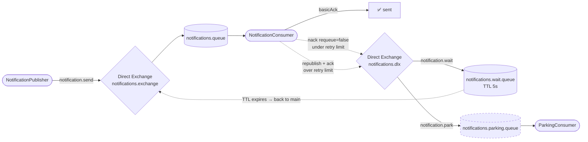

# Lesson 09 — Dead Letter Exchanges

> **Goal:** Stop throwing poison messages away. In Lesson 08 a message that failed twice was dropped with `nack(requeue=false)` — gone, unobservable. A **Dead Letter Exchange (DLX)** reroutes those rejected messages somewhere you control, so you can *delay-and-retry* them and, when they still won't process, *park* them for a human to inspect.

---

## What We're Building

We keep the **notifications** consumer from Lesson 08 and give its dropped messages a home: a DLX that feeds a **wait queue** (delayed retry) and a **parking queue** (final resting place after too many failures).



**Scenario:** Same notification provider as Lesson 08. A transient outage clears in a few seconds — so instead of retrying *instantly* (and hammering a provider that's still down), we wait 5 seconds and try again, up to a few times. A message that's still failing after every retry is almost certainly a bad payload — so it goes to a **parking** queue you can open, read, and replay by hand. Nothing is ever silently lost.

---

## Recap — Where Lesson 08 Left the Poison Message

Lesson 08's final branch was:

```java
channel.basicNack(deliveryTag, false, false); // failed again — give up
```

`requeue=false` deletes the message. That stopped the infinite loop, but it also **threw the message on the floor**. You couldn't see it, count it, alert on it, or replay it. For a payment or a password-reset email, silently deleting it is not acceptable.

A DLX fixes exactly this. `requeue=false` no longer means "delete" — it means "hand this message to the dead-letter exchange." What happens next is *your* topology.

---

## What a Dead Letter Exchange Actually Is

There is no special "dead letter" exchange type. `notifications.dlx` is an ordinary `DirectExchange`. The word **dead-letter** describes *how a message arrives at it*, not what it is. You attach a DLX to a queue with a single argument, and RabbitMQ forwards messages there when they "die."

A message is **dead-lettered** from a queue for exactly three reasons:

| Trigger | What happened | We use it? |
|---------|---------------|------------|
| `basicNack` / `basicReject` with `requeue=false` | The consumer rejected it and refused a requeue | ✅ Yes — the main queue |
| **Message TTL expires** | The message sat longer than the queue's `x-message-ttl` | ✅ Yes — the wait queue |
| **Queue length limit** (`x-max-length`) exceeded | The queue is full; the oldest message is pushed out | ✗ Not here |

The trick this lesson exploits: a queue can dead-letter *to another queue*, and that queue can have a **TTL** that dead-letters *back*. Chain those together and you get a timed retry loop with no scheduler, no external state — just queue arguments.

> **A DLX is configured on the *source* queue, not the exchange.** You don't "publish to a DLX." You tell a queue "when a message dies here, send it to exchange X with routing key Y" via the `x-dead-letter-exchange` and `x-dead-letter-routing-key` arguments. RabbitMQ does the rest.

---

## The `x-death` Header — Your Retry Counter

Every time a message is dead-lettered, RabbitMQ stamps (or updates) an **`x-death`** header on it. This is the counter Lesson 08's `redelivered` bit couldn't be: `redelivered` is one bit ("seen before, yes/no"); `x-death` actually **counts**, and it **survives a broker restart** because it lives on the message.

`x-death` is a **list of maps**, one entry per `(queue, reason)` pair. The fields that matter:

| Field | Type | Meaning |
|-------|------|---------|
| `reason` | String | `rejected` (nacked with requeue=false), `expired` (TTL), or `maxlen` |
| `count` | Long | How many times **this** (queue, reason) event has happened |
| `queue` | String | The queue the message was dead-lettered *from* |
| `time`, `exchange`, `routing-keys` | — | When, and where it came from |

Our retry counter is the `count` on the entry where **`queue == notifications.queue` and `reason == "rejected"`** — i.e. how many times the *main* queue has rejected this exact message.

> **`x-death` is a list, not a number.** As a message bounces main → wait → main → wait, it accumulates *two* entries: one for `notifications.queue`/`rejected` and one for `notifications.wait.queue`/`expired`, each with its own climbing `count`. Read the wrong entry and your retry limit will be off. We filter for `queue=notifications.queue, reason=rejected`.

---

## Step 1 — Configure the DLX and Dead-Letter the Main Queue

Add the DLX and rewrite the `notifications.queue` bean so it dead-letters into that DLX. In Lesson 08 the queue was `new Queue(NOTIFICATIONS_QUEUE, true)`; now it carries arguments.

Add to `RabbitMQConfig.java`:

```java
public static final String NOTIFICATIONS_DLX      = "notifications.dlx";
public static final String NOTIFICATION_WAIT_KEY  = "notification.wait";
public static final String NOTIFICATION_PARK_KEY  = "notification.park";

@Bean
public DirectExchange notificationsDlx() {
    return new DirectExchange(NOTIFICATIONS_DLX);
}

@Bean
public Queue notificationsQueue() {
    return QueueBuilder.durable(NOTIFICATIONS_QUEUE)
            .withArgument("x-dead-letter-exchange", NOTIFICATIONS_DLX)
            .withArgument("x-dead-letter-routing-key", NOTIFICATION_WAIT_KEY)
            .build();
}
```

> **Imports you'll need:**
> ```java
> import org.springframework.amqp.core.QueueBuilder;
> import org.springframework.amqp.core.DirectExchange;
> ```

When the consumer nacks a message with `requeue=false`, RabbitMQ now forwards it to `notifications.dlx` with routing key `notification.wait` — instead of dropping it.

> **You must delete the old queue first.** You already declared `notifications.queue` in Lesson 08 *without* these arguments. RabbitMQ will **not** let you redeclare an existing queue with different arguments — the app will fail to start with a `PRECONDITION_FAILED` error. Open `http://localhost:15672` → **Queues** → `notifications.queue` → **Delete**, then restart. (In production you'd create a new queue name or use a migration; deleting is fine for a demo.)

---

## Step 2 — Add the Wait Queue and the Parking Queue

Two more queues and two bindings on the DLX. The **wait queue** is where the retry delay happens; the **parking queue** is the terminal home for give-ups.

```java
public static final String NOTIFICATIONS_WAIT_QUEUE    = "notifications.wait.queue";
public static final String NOTIFICATIONS_PARKING_QUEUE = "notifications.parking.queue";

@Bean
public Queue notificationsWaitQueue() {
    return QueueBuilder.durable(NOTIFICATIONS_WAIT_QUEUE)
            .withArgument("x-message-ttl", 5000)
            .withArgument("x-dead-letter-exchange", NOTIFICATIONS_EXCHANGE)
            .withArgument("x-dead-letter-routing-key", NOTIFICATION_SEND_KEY)
            .build();
}

@Bean
public Queue notificationsParkingQueue() {
    return QueueBuilder.durable(NOTIFICATIONS_PARKING_QUEUE).build();
}

@Bean
public Binding notificationsWaitBinding() {
    return BindingBuilder.bind(notificationsWaitQueue()).to(notificationsDlx()).with(NOTIFICATION_WAIT_KEY);
}

@Bean
public Binding notificationsParkingBinding() {
    return BindingBuilder.bind(notificationsParkingQueue()).to(notificationsDlx()).with(NOTIFICATION_PARK_KEY);
}
```

The wait queue is the whole trick. A message lands here, has **no consumer**, sits for `x-message-ttl` = 5000 ms, then *expires*. Expiry is a dead-letter trigger — and this queue's own `x-dead-letter-exchange` points **back** to `notifications.exchange` with routing key `notification.send`. So after 5 seconds the message reappears in `notifications.queue` and the consumer sees it again.

> **The wait queue needs its *own* dead-letter args, or the retry never happens.** Without them, an expired message is simply deleted — the message would wait 5 seconds and then vanish. The `x-dead-letter-exchange` → `notifications.exchange` is what closes the loop. (`NOTIFICATION_SEND_KEY` is the `"notification.send"` constant from Lesson 08.)

---

## Step 3 — Update the Consumer to Count and Divert

The consumer's decision changes. Instead of "requeue once, then drop," it now reads the `x-death` count and either lets the message dead-letter into the retry loop, or — once it's out of retries — republishes it to the parking queue and acks.

Update `src/main/java/com/javaguy/springrabbitmq/consumer/NotificationConsumer.java`:

```java
package com.javaguy.springrabbitmq.consumer;

import static com.javaguy.springrabbitmq.config.RabbitMQConfig.NOTIFICATIONS_DLX;
import static com.javaguy.springrabbitmq.config.RabbitMQConfig.NOTIFICATIONS_QUEUE;
import static com.javaguy.springrabbitmq.config.RabbitMQConfig.NOTIFICATION_PARK_KEY;

import java.io.IOException;
import java.util.List;
import java.util.Map;

import org.springframework.amqp.rabbit.annotation.RabbitListener;
import org.springframework.amqp.rabbit.core.RabbitTemplate;
import org.springframework.amqp.support.AmqpHeaders;
import org.springframework.messaging.handler.annotation.Header;
import org.springframework.stereotype.Component;

import com.rabbitmq.client.Channel;

@Component
public class NotificationConsumer {

    private static final long MAX_RETRIES = 3;

    private final RabbitTemplate rabbitTemplate;

    public NotificationConsumer(RabbitTemplate rabbitTemplate) {
        this.rabbitTemplate = rabbitTemplate;
    }

    @RabbitListener(queues = NOTIFICATIONS_QUEUE, containerFactory = "manualAckContainerFactory")
    public void onNotification(
            String message,
            Channel channel,
            @Header(AmqpHeaders.DELIVERY_TAG) long deliveryTag,
            @Header(name = "x-death", required = false) List<Map<String, Object>> xDeath) throws IOException {

        long retries = rejectedCount(xDeath);
        IO.println("[Notifier] processing: " + message + " (retries so far=" + retries + ")");

        try {
            if (message.startsWith("FAIL")) {
                throw new IllegalStateException("delivery provider rejected the message");
            }
            IO.println("[Notifier] sent — ack");
            channel.basicAck(deliveryTag, false);
        } catch (Exception e) {
            if (retries < MAX_RETRIES) {
                IO.println("[Notifier] failed — dead-letter for retry #" + (retries + 1) + " in 5s: " + e.getMessage());
                channel.basicNack(deliveryTag, false, false);
            } else {
                IO.println("[Notifier] out of retries — parking: " + e.getMessage());
                rabbitTemplate.convertAndSend(NOTIFICATIONS_DLX, NOTIFICATION_PARK_KEY, message);
                channel.basicAck(deliveryTag, false);
            }
        }
    }

    private long rejectedCount(List<Map<String, Object>> xDeath) {
        if (xDeath == null) {
            return 0;
        }
        return xDeath.stream()
                .filter(entry -> NOTIFICATIONS_QUEUE.equals(entry.get("queue")))
                .filter(entry -> "rejected".equals(entry.get("reason")))
                .map(entry -> (Long) entry.get("count"))
                .findFirst()
                .orElse(0L);
    }
}
```

**What each piece does:**

| Code | Why it's here |
|------|---------------|
| `@Header(name = "x-death", required = false) List<Map<String,Object>> xDeath` | The retry ledger. `required = false` because the **first** delivery has no `x-death` yet |
| `rejectedCount(...)` | Pulls the `count` from the one entry where the *main* queue rejected this message — that's the true retry count |
| `retries < MAX_RETRIES` → `basicNack(tag, false, false)` | Under the limit: reject with no requeue, so it dead-letters to `notifications.dlx` → wait queue → back in 5s |
| over the limit → `convertAndSend(DLX, NOTIFICATION_PARK_KEY, message)` **then** `basicAck` | We can't nack it to parking — a nack always uses the queue's fixed dead-letter key (`notification.wait`). So we **publish** it to the park route ourselves, then ack the original to remove it |

> **Why republish-then-ack instead of a second nack?** A nack dead-letters using the *queue's* `x-dead-letter-routing-key` — which is hard-wired to `notification.wait`. The consumer can't override it per message. To send a message to a *different* dead-letter route (parking), you publish it there explicitly and ack the original. The golden rule from Lesson 08 still holds: every path ends in exactly one ack or nack.

---

## Step 4 — A Consumer on the Parking Queue

The whole point of parking is that a human (or an alert, or a replay job) can find the message later. Prove it lands by giving the parking queue a listener.

Create `src/main/java/com/javaguy/springrabbitmq/consumer/ParkingConsumer.java`:

```java
package com.javaguy.springrabbitmq.consumer;

import static com.javaguy.springrabbitmq.config.RabbitMQConfig.NOTIFICATIONS_PARKING_QUEUE;

import org.springframework.amqp.rabbit.annotation.RabbitListener;
import org.springframework.stereotype.Component;

@Component
public class ParkingConsumer {

    @RabbitListener(queues = NOTIFICATIONS_PARKING_QUEUE)
    public void onParked(String message) {
        IO.println("[Parking] dead message stored for inspection: " + message);
    }
}
```

Plain auto-ack is fine here — parking is a dead-end, there's no further retry decision to make. In a real system this listener would persist the payload to a table or fire an alert instead of just logging.

> **This listener is only for the demo.** In production you'd often leave the parking queue with **no consumer** so messages accumulate visibly in the management UI until someone deals with them. A listener that logs-and-acks empties the queue immediately — handy to *see* the message arrive, but it means the queue looks empty afterward.

---

## Step 5 — Run and Observe

Start the app and RabbitMQ (`docker compose up -d`). Remember to delete the old `notifications.queue` first (Step 1).

**Test A — the happy path.** A normal message processes once and acks — no dead-lettering at all:

```bash
curl -X POST "http://localhost:8081/api/notifications?message=Welcome+aboard"
```

```
[Publisher] queuing notification: Welcome aboard
[Notifier] processing: Welcome aboard (retries so far=0)
[Notifier] sent — ack
```

**Test B — the delayed retry loop, then parking.** A `FAIL` message fails forever. Watch it retry three times with a 5-second gap each, the count climbing, then land in parking:

```bash
curl -X POST "http://localhost:8081/api/notifications?message=FAIL+bad+payload"
```

```
[Publisher] queuing notification: FAIL bad payload
[Notifier] processing: FAIL bad payload (retries so far=0)
[Notifier] failed — dead-letter for retry #1 in 5s: delivery provider rejected the message
        ... 5 second pause (message sits in notifications.wait.queue) ...
[Notifier] processing: FAIL bad payload (retries so far=1)
[Notifier] failed — dead-letter for retry #2 in 5s: delivery provider rejected the message
        ... 5 second pause ...
[Notifier] processing: FAIL bad payload (retries so far=2)
[Notifier] failed — dead-letter for retry #3 in 5s: delivery provider rejected the message
        ... 5 second pause ...
[Notifier] processing: FAIL bad payload (retries so far=3)
[Notifier] out of retries — parking: delivery provider rejected the message
[Parking] dead message stored for inspection: FAIL bad payload
```

Read the sequence — this is the whole lesson:

- **First delivery** has no `x-death` (`retries=0`). It fails → `nack(requeue=false)` → dead-lettered to the DLX → wait queue.
- **Five seconds later** the wait queue's TTL expires. The message is dead-lettered *back* to `notifications.exchange` and reappears on the main queue — now with `x-death` showing `retries=1`.
- **Each loop bumps the `rejected` count.** After the third retry the count hits `3`, so the `else` branch fires: the message is republished to `notification.park` and the original is acked.
- **It stops.** Three retries over ~15 seconds, then a permanent home — no infinite loop, no lost message.

While Test B runs, open `http://localhost:15672` → **Queues**. During each pause you'll see one message sitting in `notifications.wait.queue`; the moment the TTL fires it moves back to `notifications.queue`. At the end it flows through `notifications.parking.queue`.

---

## What You Should Understand by Now

- A **DLX is an ordinary exchange**; "dead-letter" is *how a message reaches it*. You attach one to a queue with `x-dead-letter-exchange` — the queue, not the exchange, holds the config.
- Messages dead-letter for three reasons: **rejected** (`nack`/`reject` requeue=false), **expired** (message TTL), or **maxlen**. This lesson uses the first two.
- A **wait queue** = a queue with a TTL and no consumer whose own DLX points back to the main exchange. Message in → 5s later → back to main. That's a delayed retry with zero scheduling code.
- The **`x-death` header** is a *list* of `(queue, reason)` entries, each with a real `count`. It's a durable retry counter — far better than Lesson 08's `redelivered` bit — but you must read the right entry.
- A `nack` always dead-letters using the queue's **fixed** routing key. To send a message to a *different* route (parking), **republish it and ack the original**.
- Parking gives poison messages a home you can **inspect, alert on, and replay** — the production-grade answer to Lesson 08's "just drop it."

---

## Exercises Before Moving On

---

**1. Your wait queue has `x-message-ttl` but you forgot its `x-dead-letter-exchange`. What happens to a message that lands there?**

<details>
<summary>Reveal answer</summary>

It waits 5 seconds and is then **silently deleted**. TTL expiry is a dead-letter trigger, but with no `x-dead-letter-exchange` on the wait queue there's nowhere to send the expired message — so RabbitMQ just discards it. The retry loop is broken and every failing message vanishes after one 5-second pause. The wait queue's *own* dead-letter args are what send the message back to the main exchange; they are not optional.

</details>

---

**2. Why do we `convertAndSend` to the parking route and then `basicAck`, instead of just `basicNack`-ing the message to parking?**

<details>
<summary>Reveal answer</summary>

Because a `basicNack` with `requeue=false` dead-letters using the **queue's** configured `x-dead-letter-routing-key` — which is hard-wired to `notification.wait`. A consumer cannot choose a different dead-letter routing key per message. So a nack would send the message back into the *retry* loop, never to parking. To route it somewhere else you publish it there yourself, then ack the original so it leaves the main queue. Exactly one settle per path still holds — the ack is the settle.

</details>

---

**3. As a message bounces through the loop, its `x-death` header grows. What two entries does it end up with, and which one is our retry counter?**

<details>
<summary>Reveal answer</summary>

Two entries:
- `queue = notifications.queue`, `reason = rejected` — incremented every time the **main** queue nacks it.
- `queue = notifications.wait.queue`, `reason = expired` — incremented every time the **wait** queue's TTL fires.

Our counter is the first one (`rejected` on `notifications.queue`), because it counts real processing failures. If we'd naively read "the first entry's count" or summed them, the retry limit would trigger at the wrong time. Always filter `x-death` by both `queue` **and** `reason`.

</details>

---

**4. The message we republish to parking is a plain `String`. Does the parked message still carry the `x-death` header, and how would you preserve it if you needed the failure history?**

<details>
<summary>Reveal answer</summary>

No. `convertAndSend(exchange, key, "some string")` builds a **brand-new** message from just the body — the original headers, including `x-death`, are lost. The parked message shows up with no failure history.

To keep it, forward the original message instead of a new one: take the raw `org.springframework.amqp.core.Message` in the listener (`public void onNotification(Message amqpMessage, Channel channel, ...)`), read the body with `new String(amqpMessage.getBody())`, and republish with `rabbitTemplate.send(NOTIFICATIONS_DLX, NOTIFICATION_PARK_KEY, amqpMessage)` — `send` (not `convertAndSend`) preserves the message properties and every header. Now the parked message still carries its full `x-death` trail for debugging.

</details>

---

## Checkpoint

- [ ] Where is a DLX configured — on the exchange or on the source queue? Which argument attaches it?
- [ ] What are the three reasons a message gets dead-lettered?
- [ ] How does a "wait queue" produce a delayed retry with no scheduler? What two arguments make it work?
- [ ] What does the `x-death` header give you that the `redelivered` flag can't — and why must you filter it by queue *and* reason?
- [ ] Why can't a `nack` send a message to the parking queue, and what do you do instead?

---

## Next

`10-rpc.md` — Every pattern so far has been one-way: fire a message, move on. **RPC (Remote Procedure Call)** over RabbitMQ makes a request and *waits for a reply* — the client sends a message with a `replyTo` queue and a `correlationId`, the server processes it and publishes the answer back to that queue, and the client matches the reply to its request. We'll build request/reply on top of everything you now know about exchanges, queues, and acks.
